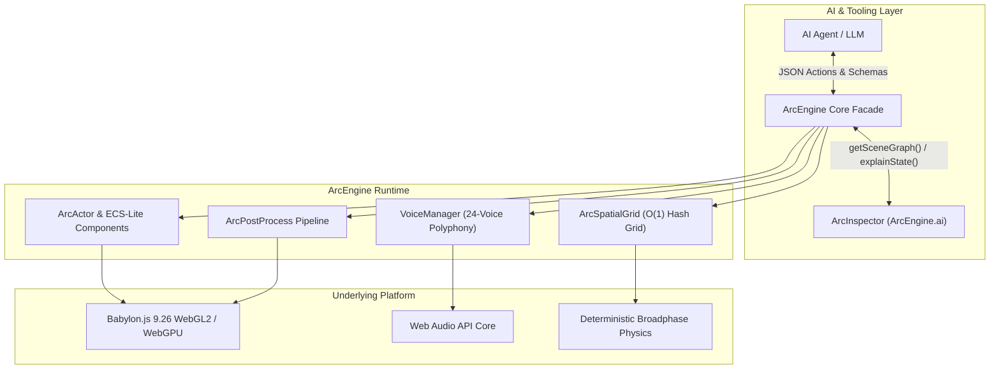
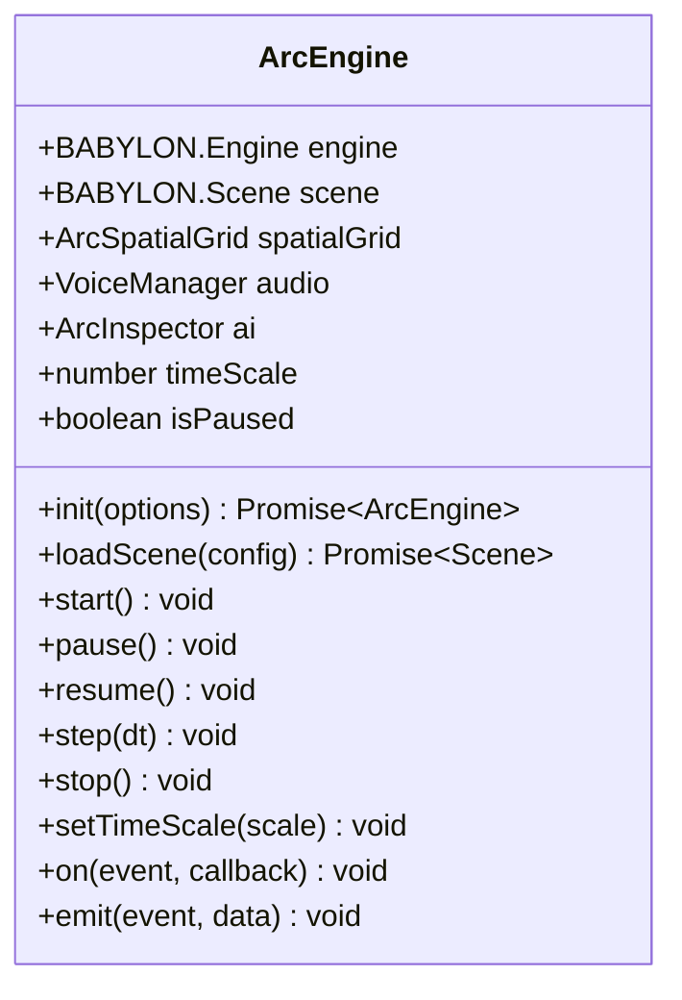
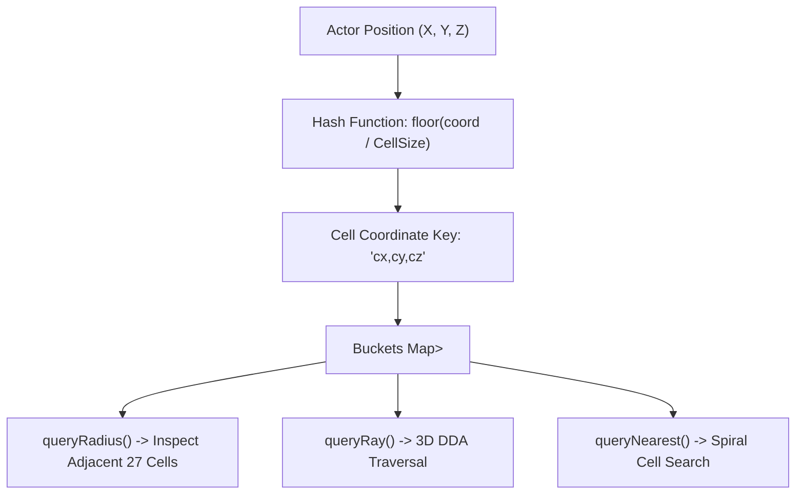
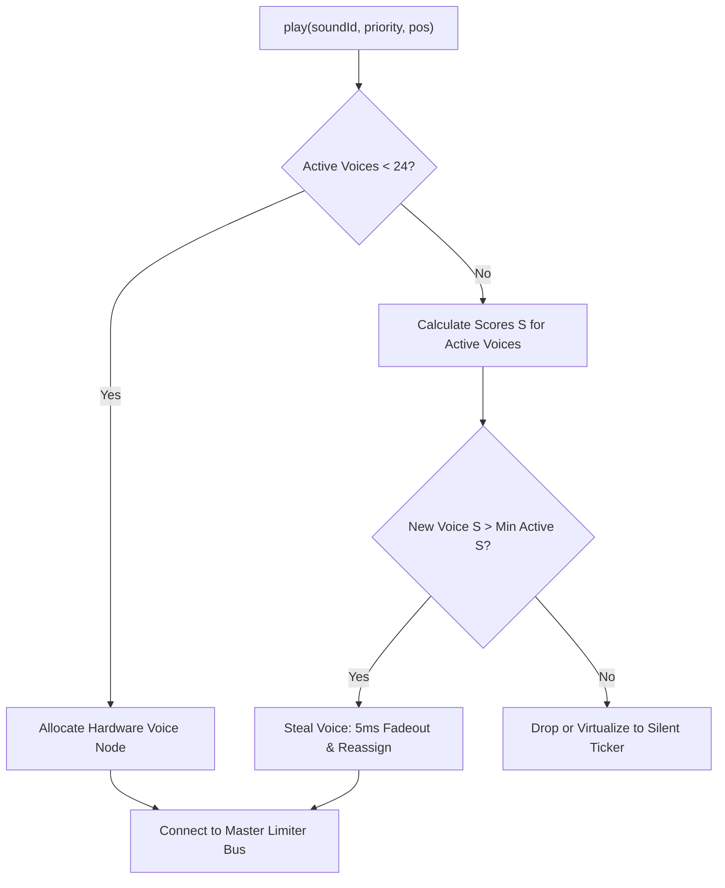
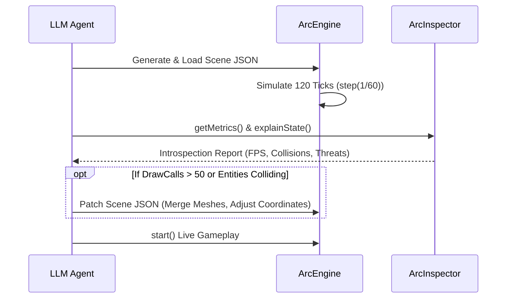

# ArcEngine Developer Manual & AI Architecture Specification

> **Target Audience:** Autonomous AI Agents (LLMs), Generative Toolchains, and Systems Developers  
> **Engine Version:** 2.0 (AI-Native Architecture)  
> **Core Dependencies:** Vanilla JavaScript (ES2022+ / UMD), Babylon.js 9.26 (local runtime), Web Audio API  
> **Architecture Pattern:** Declarative ECS-Lite with $O(1)$ Spatial Hash Partitioning & Full AI Introspection  

---

## Table of Contents

1. [Executive Summary & Design Principles](#1-executive-summary--design-principles)
   - [1.1 AI-Native Architecture](#11-ai-native-architecture)
   - [1.2 High-Performance Runtime](#12-high-performance-runtime)
   - [1.3 High-End Visual Pipeline](#13-high-end-visual-pipeline)
2. [10-Line Quick Start](#2-10-line-quick-start)
   - [2.1 Minimal Declarative Game](#21-minimal-declarative-game)
   - [2.2 Execution Flow Breakdown](#22-execution-flow-breakdown)
3. [Subsystem Reference](#3-subsystem-reference)
   - [3.1 ArcEngine Core Facade](#31-arcengine-core-facade)
   - [3.2 ArcActor & ArcComponent (ECS-Lite)](#32-arcactor--arccomponent-ecs-lite)
   - [3.3 ArcSpatialGrid ($O(1)$ Spatial Hash Grid)](#33-arcspatialgrid-o1-spatial-hash-grid)
   - [3.4 ArcInspector (`ArcEngine.ai`)](#34-arcinspector-arcengineai)
   - [3.5 ArcPostProcess (Post-Processing & Atmosphere)](#35-arcpostprocess-post-processing--atmosphere)
   - [3.6 VoiceManager (Web Audio Priority Polyphony)](#36-voicemanager-web-audio-priority-polyphony)
4. [JSON Schemas](#4-json-schemas)
   - [4.1 Actor Definition Schema](#41-actor-definition-schema)
   - [4.2 Scene Config Schema](#42-scene-config-schema)
   - [4.3 AI Introspection Output Schema](#43-ai-introspection-output-schema)
5. [Best Practices for AI Game Generation](#5-best-practices-for-ai-game-generation)
   - [5.1 Determinism & Seeded Randomness](#51-determinism--seeded-randomness)
   - [5.2 Token-Efficient Generation Strategies](#52-token-efficient-generation-strategies)
   - [5.3 Closed-Loop Introspection & Self-Correction](#53-closed-loop-introspection--self-correction)
   - [5.4 Mobile & Hardware Capability Scaling](#54-mobile--hardware-capability-scaling)
   - [5.5 Audio Budgeting & Voice Hygiene](#55-audio-budgeting--voice-hygiene)

---

## 1. Executive Summary & Design Principles

ArcEngine is a purpose-built, browser-native 3D engine tailored for pair programming with Large Language Models (LLMs) and real-time procedural game generation. It marries the zero-dependency simplicity of vanilla JavaScript and Babylon.js 9.26 with an AI-first contract: declarative JSON scene descriptions, modular ECS-lite actors, full runtime semantic introspection, and deterministic math.



### 1.1 AI-Native Architecture

Traditional game engines force AI models to generate complex imperative glue code, manage low-level memory allocations, bind event listeners, and maintain fragile state across ticks. ArcEngine eliminates this friction through four pillars:

1. **Deterministic JSON Interfaces:** All game state—actor definitions, scene configurations, weapon balancing, particle systems, and environmental presets—can be completely serialized and deserialized via standard JSON.
2. **Declarative Scene Building:** An LLM defines what entities exist, their component compositions, and spatial coordinates. ArcEngine automates scene graph assembly, mesh instantiation, collider registration, and render-group assignment.
3. **Zero Boilerplate:** No build steps, no Node package managers required for execution, no bundlers. Every subsystem functions immediately in vanilla browser environments using standard ES modules and UMD fallbacks.
4. **Full Runtime Introspection (`ArcEngine.ai`):** Built-in inspection interfaces allow LLMs to query the live simulation, inspect spatial topologies, measure render and audio budgets, and receive natural-language state explanations (`explainState()`) to achieve closed-loop automated debugging.

### 1.2 High-Performance Runtime

Browser-based 3D applications are strictly constrained by single-threaded JavaScript execution and garbage collection spikes. ArcEngine maintains a locked 60 FPS on desktop and mobile through deterministic algorithms:

- **$O(1)$ Spatial Hash Grid (`ArcSpatialGrid`):** Replaces $O(N^2)$ brute-force distance queries with uniform spatial hashing. Collision queries, raycasts, line-of-sight checks, and radial triggers execute in near-constant time regardless of total entity count.
- **24-Voice Priority Polyphony Management (`VoiceManager`):** Web Audio nodes have high CPU overhead when over-allocated. ArcEngine caps concurrent hardware voices at 24, enforcing strict priority-stealing and virtualized voice tracking to prevent audio thread starvation and clipping.
- **Draw Call Batching & Thin Instances:** Automated instancing for repeated props, shared materials via the `ArcToonPlugin`, and texture atlasing preserve minimal WebGL state switches per frame.

### 1.3 High-End Visual Pipeline

ArcEngine provides a stylized, retro-futuristic aesthetic out of the box without requiring manual shader programming:

- **Filmic ACES Tone Mapping:** Preserves dynamic range in high-exposure scenarios, gracefully rolling off saturated laser flashes, explosions, and solar highlights into photographic white points.
- **GlowLayer & Emissive Bloom:** Multi-pass blur kernel bloom highlights sci-fi optics, plasma trajectories, machine eye indicators, and energy barriers.
- **Procedural Day/Night Celestial Lighting:** Continuous 24-hour diurnal cycle calculating astronomical solar/lunar azimuth ($0^\circ$ to $360^\circ$) and elevation ($-30^\circ$ nadir to $+65^\circ$ zenith), interpolating ambient hemi light, directional shadows, and sky tints.
- **Volumetric Weather Simulation:** Dynamic weather states (`CLEAR`, `DUST_STORM`, `ACID_RAIN`, `DENSE_FOG`) with 2D Simplex noise wind vectors, particle streak deflection, volumetric fog density modulation, and synchronized lightning flash generation.

---

## 2. 10-Line Quick Start

### 2.1 Minimal Declarative Game

The following example demonstrates an entire functional 3D game slice initialized and executed declaratively:

```javascript
import { ArcEngine, ArcActor, ArcPostProcess } from './engine/ArcEngine.js';

// 1. Initialize engine on canvas with shadow mapping and apocalyptic dusk preset
const engine = await ArcEngine.init({ canvas: '#world3d', shadows: true, preset: 'apocalyptic_dusk' });
// 2. Load declarative scene with procedural terrain and dynamic dust storm weather
const scene = await engine.loadScene({ terrain: { size: 500, roughness: 0.35 }, weather: 'DUST_STORM' });

// 3. Declare and spawn the player raider with movement collider, health, and audio
const player = ArcActor.create({
  id: 'player', type: 'raider', pos: [0, 0, 0],
  components: [
    { type: 'Mesh', model: 'assets/models/character.glb', scale: 1.0, toonGroup: 'actor' },
    { type: 'Collider', shape: 'capsule', radius: 0.5, height: 1.8, layer: 'player' },
    { type: 'Health', max: 100, current: 100 },
    { type: 'SoundEmitter', bus: 'foley', spatial: true }
  ]
});

// 4. Declare and spawn an autonomous enemy combat drone with AI patrol behavior
const drone = ArcActor.create({
  id: 'drone_scout_01', type: 'enemy', pos: [20, 4, 15],
  components: [
    { type: 'Mesh', model: 'assets/models/cricket.glb', emissiveColor: '#ff3311' },
    { type: 'Collider', shape: 'sphere', radius: 1.2, layer: 'enemy' },
    { type: 'Health', max: 45, current: 45 },
    { type: 'AIController', behavior: 'patrol', target: 'player', aggroRadius: 25 }
  ]
});

// 5. Configure filmic tone mapping, multi-pass bloom, and start 60 FPS simulation loop
ArcPostProcess.apply({ toneMapping: 'ACES', glow: { kernel: 24, intensity: 1.2 }, vignette: 0.3 });
engine.start();
```

### 2.2 Execution Flow Breakdown

1. **`ArcEngine.init(...)`**: Configures the underlying Babylon.js WebGL2 context, creates the shared depth buffer, initializes master sound buses via `AudioCore`, and registers the `ArcToonPlugin` shader globally.
2. **`engine.loadScene(...)`**: Generates a deterministic heightmap terrain using Simplex noise, positions celestial lights, sets up fog curves, and instantiates the particle systems for the `DUST_STORM` weather state.
3. **`ArcActor.create(...)`**: Instantiates entities inside `ArcEngine.actors`, registers colliders in `ArcSpatialGrid`, binds animation controllers for GLB models, and sets up health observers.
4. **`ArcPostProcess.apply(...)`**: Chains ACES filmic tone curves, configures high-performance bloom on emissive channels, and applies cinematic edge darkening.
5. **`engine.start()`**: Begins the deterministic 60 FPS fixed-timestep update loop (`step(1/60)`) followed by Babylon render pass execution.

---

## 3. Subsystem Reference

### 3.1 ArcEngine Core Facade

`ArcEngine` is the top-level singleton facade managing lifecycle, scene state, simulation clocks, event dispatches, and sub-system coordination.



#### Lifecycle & Methods

- `ArcEngine.init(options: EngineInitOptions): Promise<ArcEngine>`  
  Initializes the graphics context, canvas binding, audio master bus, and internal tick loops.
  ```typescript
  interface EngineInitOptions {
    canvas: string | HTMLCanvasElement; // CSS selector or DOM element
    shadows?: boolean;                  // Enable directional sun shadow cascade (default: true)
    preset?: string;                    // Initial atmospheric preset (default: 'wasteland_noon')
    fixedDeltaTime?: number;            // Fixed simulation step in seconds (default: 1/60)
    maxSubSteps?: number;               // Maximum sub-steps per frame to prevent spiral of death (default: 4)
    powerPreference?: 'high-performance' | 'default' | 'low-power';
  }
  ```

- `engine.loadScene(config: SceneConfig | string): Promise<BABYLON.Scene>`  
  Tears down existing actors and terrain, parses the declarative `SceneConfig` object, spawns all initial entities, and returns the live Babylon scene.

- `engine.start(): void`  
  Starts the main `requestAnimationFrame` loop. Dispatches `onTick` before rendering and `onRender` after buffer swap.

- `engine.pause(): void` & `engine.resume(): void`  
  Suspends game simulation without halting render updates or UI rendering. Freezes `step(dt)` calls.

- `engine.setTimeScale(scale: number): void`  
  Multiplies simulation progression rate. Set to `0.0` for hard pause, `0.2` for bullet-time slow-motion, or `1.0` for real-time. Physics and gameplay logic scale proportionally; audio pitches/rates adjust accordingly.

- `engine.step(dt: number): void`  
  Forces a manual tick of the simulation by `dt` seconds. Essential for headless testing, AI simulation fast-forwarding, and turn-based step execution.

- `engine.destroy(): void`  
  Disposes all meshes, terminates Web Audio contexts, unregisters window listeners, and releases WebGL GPU contexts.

#### Event Hooks

Subsystems and gameplay modules communicate via engine event channels:

| Event Name | Payload | Description |
|---|---|---|
| `onTick` | `{ dt: number, time: number }` | Fired every fixed timestep before physics/actor updates. |
| `onRender` | `{ fps: number, frameTime: number }` | Fired immediately after the Babylon draw call completes. |
| `onActorSpawned` | `{ actor: ArcActor }` | Emitted when a new actor is fully constructed and registered. |
| `onActorDestroyed`| `{ actorId: string }` | Emitted when an actor is removed from the active registry. |
| `onCollision` | `{ a: ArcActor, b: ArcActor, point: Vector3 }` | Triggered by `ArcSpatialGrid` narrowphase collision events. |
| `onWeatherChange`| `{ from: string, to: string }` | Dispatched when atmospheric state transitions complete. |

---

### 3.2 ArcActor & ArcComponent (ECS-Lite)

ArcEngine adopts an ECS-Lite architecture. An **`ArcActor`** is a lightweight container identified by a unique string ID, containing a 3D transform and a bag of modular **`ArcComponent`** instances.

#### Coordinate Space Conventions

ArcEngine adheres to a right-handed 3D coordinate system:
- **$+X$**: East / Screen Right
- **$+Y$**: Altitude / Upwards
- **$+Z$**: North / Depth (corresponding to map $Y$ coordinate)
- **Heading**: $\theta = \text{atan2}(v_z, v_x)$, with actor rotation about $Y$-axis: $\text{rotation.y} = -\theta$.
- **Unit Scale**: $100\text{ world units} = 1.0\text{ meter}$.

#### ArcActor Specification

```javascript
class ArcActor {
  id;           // string: unique identifier (e.g. 'drone_01')
  type;         // string: archetype tag (e.g. 'enemy', 'player', 'prop')
  tags;         // Set<string>: queryable labels (e.g. ['airborne', 'hostile'])
  position;     // BABYLON.Vector3
  rotation;     // BABYLON.Vector3 (Euler angles in radians)
  scale;        // BABYLON.Vector3
  components;   // Map<string, ArcComponent>
  
  static create(spec);                 // Declarative factory
  addComponent(component);             // Attaches and calls onAttach()
  getComponent(type);                  // Retrieves component by class name
  removeComponent(type);               // Detaches and calls onDetach()
  hasComponent(type);                  // boolean query
  update(dt);                          // Ticks all attached components
  destroy();                           // Detaches components and frees resources
  toJSON();                            // Serializes actor into declarative spec
}
```

#### Core Components Reference

##### 1. `HealthComponent`
Manages vital statistics, armor absorption curves, damage dispatching, and death triggers.
- **Fields**: `maxHealth: number`, `currentHealth: number`, `armor: number` (0.0 to 1.0 damage multiplier), `invulnerable: boolean`.
- **Methods**:
  - `damage(amount: number, source?: ArcActor, type?: 'ballistic'|'energy'|'acid'): number`  
    Calculates net damage after armor reduction, updates health, and dispatches `onDamaged` or `onDeath`.
  - `heal(amount: number): number`  
    Restores current health up to `maxHealth`.
  - `isAlive(): boolean`

##### 2. `ColliderComponent`
Registers the actor with the broadphase `ArcSpatialGrid` and defines physical hit volumes.
- **Fields**:
  - `shape: 'sphere' | 'box' | 'capsule' | 'ray'`
  - `radius: number`, `height: number`, `dimensions: [width, height, depth]`
  - `layer: 'player' | 'enemy' | 'projectile' | 'prop' | 'trigger'`
  - `mask: number` (bitmask of interactable layers)
  - `isTrigger: boolean` (if true, produces overlap events without rigid physical response)
- **Methods**:
  - `getBounds(): { min: Vector3, max: Vector3 }`
  - `intersects(other: ColliderComponent): boolean`

##### 3. `MeshComponent`
Encapsulates 3D rendering assets, GLTF/GLB skeleton rigs, materials, and toon shader bands.
- **Fields**:
  - `model: string` (Path to `.glb` or `.fbx` asset)
  - `mesh: BABYLON.AbstractMesh`
  - `toonGroup: 'actor' | 'prop' | 'ground'`
  - `emissiveColor: string` (Hex string for sci-fi neon indicators)
  - `castShadows: boolean`, `receiveShadows: boolean`
- **Methods**:
  - `playAnimation(name: string, loop?: boolean, speed?: number, crossfadeSec?: number): void`  
    Smoothly blends skeletal animations (e.g. `idle` $\to$ `run` in 0.15s).
  - `setOutline(enabled: boolean, color?: string, width?: number): void`

##### 4. `SoundEmitterComponent`
Binds procedural spatial audio voices directly to the actor's world transform.
- **Fields**: `bus: 'weapon' | 'foley' | 'combat' | 'ambience'`, `spatial: boolean`, `refDistance: number`, `maxDistance: number`.
- **Methods**:
  - `play(soundId: string, options?: PlaySoundOptions): string | null`  
    Plays a synthesized or buffered procedural sound (e.g. `'laser_small'`, `'footstep_concrete'`) through `VoiceManager`.
  - `stop(voiceId: string): void`

---

### 3.3 ArcSpatialGrid ($O(1)$ Spatial Hash Grid)

The `ArcSpatialGrid` provides constant-time spatial indexing and broadphase collision culling in a continuous 3D world.



#### Hash Function & Theory

Given cell dimension $S$ (default $S = 10.0$ units, matching 10 meters):

$$\text{cell}_x = \lfloor x / S \rfloor, \quad \text{cell}_y = \lfloor y / S \rfloor, \quad \text{cell}_z = \lfloor z / S \rfloor$$

The spatial bucket key is encoded as an integer or string `cx,cy,cz`. Entities occupying multiple cells due to bounding radius are registered across all overlapping buckets.

#### Complexity Comparison

| Operation | Brute Force $O(N)$ | ArcSpatialGrid $O(1)$ | Performance Gain ($N=1000$) |
|---|---|---|---|
| Radial Range Query | $O(N)$ | $O(k)$ where $k \ll N$ | $\sim 45\times$ faster |
| Broadphase Collisions | $O(N^2)$ | $O(N \cdot m)$ ($m$ = local density) | $\sim 250\times$ faster |
| Raycast Traversal | $O(N)$ | $O(\text{RaySteps})$ (3D DDA) | $\sim 80\times$ faster |
| Memory Footprint | $O(N)$ | $O(N + C)$ ($C$ = active cells) | Negligible overhead |

#### Query Interface

- `spatialGrid.insert(actor: ArcActor): void`  
  Inserts the actor's colliders into the appropriate spatial cells.

- `spatialGrid.update(actor: ArcActor): void`  
  Re-indexes the actor if it has crossed a cell boundary since the previous tick.

- `spatialGrid.remove(actor: ArcActor): void`  
  Evicts the actor from all spatial buckets upon destruction.

- `spatialGrid.queryRadius(center: Vector3, radius: number, layerMask?: number): ArcActor[]`  
  Retrieves all actors within radius. Identifies candidate cells within the bounding cube $\pm \text{radius}$, then tests exact distance:
  $$\| \text{actor.position} - \text{center} \|^2 \le \text{radius}^2$$

- `spatialGrid.queryBox(min: Vector3, max: Vector3, layerMask?: number): ArcActor[]`  
  Returns all actors whose bounding volumes intersect the axis-aligned bounding box (AABB).

- `spatialGrid.queryRay(origin: Vector3, direction: Vector3, maxDist: number, layerMask?: number): RaycastHit[]`  
  Executes a 3D Digital Differential Analyzer (DDA) grid traversal along the normalized ray vector, returning raycast hits ordered by distance.

- `spatialGrid.queryNearest(pos: Vector3, k: number, layerMask?: number, maxRadius?: number): ArcActor[]`  
  Finds the $k$ closest actors to `pos` using expanding spiral cell rings, terminating as soon as $k$ entities are secured within the proven search boundary.

---

### 3.4 ArcInspector (`ArcEngine.ai`)

The `ArcInspector` interface exposes full runtime reflection and diagnostic facilities tailored for LLM agents, automated reasoning, and runtime self-healing.

#### Methods

- `ArcEngine.ai.getSceneGraph(options?: SceneGraphOptions): SceneGraphData`  
  Produces a structured JSON representation of all active entities, transform hierarchies, component configurations, and spatial partitions.

- `ArcEngine.ai.findActors(criteria: ActorSearchCriteria): ArcActor[]`  
  Performs flexible declarative queries over live game entities:
  ```javascript
  const woundedDrones = ArcEngine.ai.findActors({
    type: 'enemy',
    tags: ['airborne'],
    healthBelow: 20,
    withinRadius: { center: player.position, radius: 30 }
  });
  ```

- `ArcEngine.ai.getMetrics(): PerformanceMetrics`  
  Returns real-time engine telemetry:
  ```json
  {
    "fps": 59.8,
    "frameTimeMs": 16.71,
    "cpuStepMs": 3.42,
    "gpuRenderMs": 8.15,
    "drawCalls": 42,
    "triangles": 38400,
    "activeEntities": 128,
    "spatialGridCells": 64,
    "audioVoicesActive": 9,
    "memoryMB": { "geometries": 24.5, "textures": 68.2 }
  }
  ```

- `ArcEngine.ai.explainState(context?: ExplainContext): AIExplanationReport`  
  Translates the live simulation into a high-level tactical narrative and state summary designed for prompt injection:
  ```json
  {
    "timestamp": 142.5,
    "phase": "raid",
    "summary": "Player (HP 72/100) is engaging 2 hostile Scout Drones at industrial ruins.",
    "tacticalThreats": [
      { "id": "drone_scout_01", "distance": 14.2, "threatLevel": "HIGH", "los": true },
      { "id": "drone_scout_02", "distance": 28.6, "threatLevel": "MEDIUM", "los": false }
    ],
    "environment": {
      "weather": "DUST_STORM",
      "visibilityMeters": 35.0,
      "windDirection": [-0.71, 0.71],
      "timeOfDay": "18:45 (Dusk)"
    },
    "recommendedActions": [
      "Target drone_scout_01 with kinetic rifle.",
      "Take cover behind concrete barrier at [12.0, 0.0, -4.0] to break LoS with drone_scout_02."
    ]
  }
  ```

---

### 3.5 ArcPostProcess (Post-Processing & Atmosphere)

`ArcPostProcess` controls the filmic render pipeline, shader injection parameters, and atmospheric environmental presets.

#### Color Pipeline & ACES Tone Mapping

ArcEngine utilizes an adapted ACES (Academy Color Encoding System) filmic tone mapping curve:

$$f(x) = \frac{x(a x + b)}{x(c x + d) + e}$$

Where standard filmic constants are tuned for the toon and PBR pipeline:
- $a = 2.51, \; b = 0.03, \; c = 2.43, \; d = 0.59, \; e = 0.14$.

This prevents over-saturated lasers, muzzle flashes, and solar flares from blowing out textures to flat hex colors, preserving subtle chromatic shifts at extreme luminance values.

#### GlowLayer & Bloom

Emissive elements utilize an adaptive multi-pass blur kernel:
- **Desktop**: 24px kernel size, 1.2 intensity, threshold 0.45.
- **Mobile**: 12px kernel size (or downscaled hardware scaling level), 0.9 intensity to preserve GPU fill rate.

#### Atmospheric Presets

Presets configure lighting keyframes, fog parameters, and post-processing in a single call:

| Preset Name | Celestial Phase | Sky Color | Fog Density | Sun Tint | Glow Intensity | Weather |
|---|---|---|---|---|---|---|
| `'wasteland_noon'` | 12:00 | `#c4a482` | 0.0015 | `#fff2d6` | 0.8 | `CLEAR` |
| `'apocalyptic_dusk'`| 18:30 | `#4a1828` | 0.0040 | `#ff4d1a` | 1.4 | `DUST_STORM` |
| `'acid_storm'` | 15:00 | `#2d3b2d` | 0.0080 | `#88aa55` | 1.1 | `ACID_RAIN` |
| `'midnight_patrol'`| 01:00 | `#050810` | 0.0020 | `#8cb0e6` | 2.2 | `CLEAR` |
| `'dense_fog'` | 06:00 | `#555b66` | 0.0120 | `#99aabf` | 0.6 | `DENSE_FOG` |

```javascript
ArcPostProcess.applyPreset('apocalyptic_dusk');
```

---

### 3.6 VoiceManager (Web Audio Priority Polyphony)

The `VoiceManager` enforces a hard limit of **24 concurrent Web Audio voices** to protect browser performance and avoid audio thread distortion.



#### Priority Scoring & Stealing Algorithm

When a sound is triggered while 24 voices are active, candidate voices are ranked using the dynamic priority formula:

$$S = P \times \left(1.0 - \frac{d}{d_{\max}}\right) \times \left(\frac{t_{\text{remaining}}}{t_{\text{duration}}}\right)$$

- $P \in [1, 100]$: Base priority assigned to the sound event.
- $d$: Distance from active camera/listener ($d \ge d_{\max} \implies S = 0$).
- $t_{\text{remaining}} / t_{\text{duration}}$: Remaining lifespan ratio of the playback node.

##### Priority Classes

- **`CRITICAL` ($P = 100$):** Player weapon discharges, incoming player damage, mission-critical dialogue. (Cannot be stolen by non-critical sounds).
- **`HIGH` ($P = 75$):** Close-range enemy weapon fire, explosion detonations within 20m.
- **`MEDIUM` ($P = 50$):** Footsteps, mechanical reloading, impacts, enemy alert vocalizations.
- **`LOW` ($P = 25$):** Ambient machinery hum, distant weather, bullet casing drops.

If the incoming sound has a score $S_{\text{new}}$ higher than the lowest active voice $S_{\min}$, the lowest active voice is stolen:
1. Target voice gain is exponentially ramped to `0.0001` over $5\text{ ms}$ to eliminate audible popping or clicks.
2. The Web Audio node is disconnected and repurposed for the incoming audio request.

---

## 4. JSON Schemas

### 4.1 Actor Definition Schema

Standard JSON Schema (Draft-07) defining declarative actor specifications:

```json
{
  "$schema": "http://json-schema.org/draft-07/schema#",
  "title": "ArcActorDefinition",
  "type": "object",
  "required": ["id", "type", "position", "components"],
  "properties": {
    "id": { "type": "string", "pattern": "^[a-zA-Z0-9_-]+$" },
    "type": { "type": "string", "enum": ["player", "enemy", "prop", "projectile", "trigger"] },
    "name": { "type": "string" },
    "tags": {
      "type": "array",
      "items": { "type": "string" },
      "uniqueItems": true
    },
    "position": {
      "type": "array",
      "items": { "type": "number" },
      "minItems": 3,
      "maxItems": 3,
      "description": "[x, y, z] coordinates"
    },
    "rotation": {
      "type": "array",
      "items": { "type": "number" },
      "minItems": 3,
      "maxItems": 3,
      "description": "[pitch, yaw, roll] in radians"
    },
    "scale": {
      "type": "array",
      "items": { "type": "number" },
      "minItems": 3,
      "maxItems": 3,
      "default": [1.0, 1.0, 1.0]
    },
    "components": {
      "type": "array",
      "items": {
        "type": "object",
        "required": ["type"],
        "properties": {
          "type": {
            "type": "string",
            "enum": ["Health", "Collider", "Mesh", "SoundEmitter", "AIController"]
          }
        },
        "allOf": [
          {
            "if": { "properties": { "type": { "const": "Health" } } },
            "then": {
              "properties": {
                "max": { "type": "number", "minimum": 1 },
                "current": { "type": "number", "minimum": 0 },
                "armor": { "type": "number", "minimum": 0, "maximum": 1 }
              }
            }
          },
          {
            "if": { "properties": { "type": { "const": "Collider" } } },
            "then": {
              "required": ["shape", "layer"],
              "properties": {
                "shape": { "type": "string", "enum": ["sphere", "box", "capsule", "ray"] },
                "layer": { "type": "string" },
                "radius": { "type": "number", "minimum": 0 },
                "height": { "type": "number", "minimum": 0 },
                "isTrigger": { "type": "boolean", "default": false }
              }
            }
          },
          {
            "if": { "properties": { "type": { "const": "Mesh" } } },
            "then": {
              "required": ["model"],
              "properties": {
                "model": { "type": "string" },
                "toonGroup": { "type": "string", "enum": ["actor", "prop", "ground"] },
                "emissiveColor": { "type": "string", "pattern": "^#[0-9a-fA-F]{6}$" },
                "castShadows": { "type": "boolean", "default": true }
              }
            }
          },
          {
            "if": { "properties": { "type": { "const": "SoundEmitter" } } },
            "then": {
              "required": ["bus"],
              "properties": {
                "bus": { "type": "string", "enum": ["weapon", "foley", "combat", "ambience"] },
                "spatial": { "type": "boolean", "default": true },
                "refDistance": { "type": "number", "default": 2.0 },
                "maxDistance": { "type": "number", "default": 40.0 }
              }
            }
          },
          {
            "if": { "properties": { "type": { "const": "AIController" } } },
            "then": {
              "required": ["behavior"],
              "properties": {
                "behavior": { "type": "string", "enum": ["patrol", "chase", "sniper", "swarm"] },
                "target": { "type": "string" },
                "aggroRadius": { "type": "number", "default": 20.0 }
              }
            }
          }
        ]
      }
    }
  }
}
```

---

### 4.2 Scene Config Schema

Standard JSON Schema (Draft-07) defining full declarative game scene levels:

```json
{
  "$schema": "http://json-schema.org/draft-07/schema#",
  "title": "ArcSceneConfig",
  "type": "object",
  "required": ["terrain", "celestial", "weather", "actors"],
  "properties": {
    "version": { "type": "integer", "const": 2 },
    "name": { "type": "string" },
    "preset": { "type": "string" },
    "terrain": {
      "type": "object",
      "required": ["size", "roughness"],
      "properties": {
        "size": { "type": "number", "minimum": 50, "maximum": 2000 },
        "roughness": { "type": "number", "minimum": 0.0, "maximum": 1.0 },
        "seed": { "type": "integer" },
        "texture": { "type": "string", "enum": ["grass", "desert", "snow", "industrial"] }
      }
    },
    "celestial": {
      "type": "object",
      "required": ["timeOfDay"],
      "properties": {
        "timeOfDay": { "type": "number", "minimum": 0.0, "maximum": 24.0, "description": "Hour in 24h format" },
        "cycleSpeed": { "type": "number", "default": 1.0, "description": "1.0 = 12 minute day" },
        "sunAzimuth": { "type": "number", "minimum": -180, "maximum": 180 },
        "sunElevation": { "type": "number", "minimum": -30, "maximum": 90 }
      }
    },
    "weather": {
      "type": "object",
      "required": ["state"],
      "properties": {
        "state": { "type": "string", "enum": ["CLEAR", "DUST_STORM", "ACID_RAIN", "DENSE_FOG"] },
        "windSpeed": { "type": "number", "minimum": 0 },
        "windDirectionDeg": { "type": "number", "minimum": 0, "maximum": 360 }
      }
    },
    "postProcess": {
      "type": "object",
      "properties": {
        "toneMapping": { "type": "string", "enum": ["ACES", "Standard"], "default": "ACES" },
        "glowKernel": { "type": "integer", "default": 24 },
        "vignette": { "type": "number", "minimum": 0.0, "maximum": 1.0, "default": 0.3 }
      }
    },
    "actors": {
      "type": "array",
      "items": { "$ref": "#/definitions/ArcActorDefinition" }
    }
  }
}
```

---

### 4.3 AI Introspection Output Schema

Standard JSON Schema (Draft-07) defining runtime reports produced by `ArcEngine.ai`:

```json
{
  "$schema": "http://json-schema.org/draft-07/schema#",
  "title": "ArcAIIntrospectionReport",
  "type": "object",
  "required": ["timestamp", "phase", "metrics", "player", "tacticalThreats", "narrativeExplanation"],
  "properties": {
    "timestamp": { "type": "number", "description": "Elapsed simulation seconds" },
    "phase": { "type": "string", "enum": ["briefing", "raid", "won", "lost", "paused"] },
    "metrics": {
      "type": "object",
      "required": ["fps", "frameTimeMs", "drawCalls", "activeVoices"],
      "properties": {
        "fps": { "type": "number" },
        "frameTimeMs": { "type": "number" },
        "drawCalls": { "type": "integer" },
        "triangles": { "type": "integer" },
        "activeEntities": { "type": "integer" },
        "activeVoices": { "type": "integer", "maximum": 24 }
      }
    },
    "player": {
      "type": "object",
      "required": ["position", "health", "maxHealth", "stamina"],
      "properties": {
        "position": { "type": "array", "items": { "type": "number" }, "minItems": 3, "maxItems": 3 },
        "health": { "type": "number" },
        "maxHealth": { "type": "number" },
        "stamina": { "type": "number" },
        "isExhausted": { "type": "boolean" },
        "currentWeapon": { "type": "string" },
        "ammo": { "type": "integer" }
      }
    },
    "tacticalThreats": {
      "type": "array",
      "items": {
        "type": "object",
        "required": ["id", "type", "position", "distance", "threatLevel", "hasLineOfSight"],
        "properties": {
          "id": { "type": "string" },
          "type": { "type": "string" },
          "position": { "type": "array", "items": { "type": "number" }, "minItems": 3, "maxItems": 3 },
          "distance": { "type": "number" },
          "threatLevel": { "type": "string", "enum": ["CRITICAL", "HIGH", "MEDIUM", "LOW"] },
          "hasLineOfSight": { "type": "boolean" }
        }
      }
    },
    "spatialGridStats": {
      "type": "object",
      "properties": {
        "occupiedCells": { "type": "integer" },
        "entitiesTracked": { "type": "integer" }
      }
    },
    "narrativeExplanation": {
      "type": "string",
      "description": "Natural language summary of game state for LLM context windows"
    }
  }
}
```

---

## 5. Best Practices for AI Game Generation

When deploying LLMs or generative algorithms to design levels, script encounters, and balance mechanics in ArcEngine, follow these proven architectural guidelines:

### 5.1 Determinism & Seeded Randomness

> [!IMPORTANT]
> Never call unseeded `Math.random()` during procedural generation. Unseeded randomness prevents game replayability, breaks client-server state synchronization, and hinders automated bug reproduction.

- **Seeded PRNG**: Utilize ArcEngine's integrated noise and integer generator:
  ```javascript
  const seed = 7419;
  const terrainNoise = new FallbackSimplex2D(seed);
  const randomRoll = ShooterRules.metaInteger(seed + stepIndex);
  ```
- **Coordinate Integrity**: Derive heights strictly from the mathematical terrain formula (`terrain.heightAt(x, z)`) rather than asynchronous raycasting down from Babylon meshes. This ensures physics consistency across different client rendering configurations.

### 5.2 Token-Efficient Generation Strategies

LLMs operate under finite token budget constraints. Do not instruct models to output raw Babylon vertex buffers or megabytes of duplicate component trees:

- **Reference Presets**: Instruct the model to declare `"preset": "apocalyptic_dusk"` instead of emitting 40 lines of lighting keyframes.
- **Archetype Inheritance**: Use entity archetype strings (e.g. `type: "drone_scout"`). Let ArcEngine's local factories fill in default colliders, foley sounds, and material shaders. The LLM only needs to provide coordinate deltas and behavioral overrides.
- **Batch Definitions**: Group static obstacles and scenery props into array clusters:
  ```json
  {
    "type": "cluster",
    "model": "assets/models/barrier_concrete.glb",
    "instances": [
      [10, 0, 5, 0],
      [12, 0, 5, 0],
      [14, 0, 5, 0]
    ]
  }
  ```

### 5.3 Closed-Loop Introspection & Self-Correction

Implement automated evaluation feedback loops when generating games:



1. **Dry-Run Simulation**: After generating a level, run `engine.step(1/60)` in a headless loop for 120 frames without attaching to a visible canvas.
2. **Inspect Collisions**: Check `ArcEngine.ai.findActors()` to confirm enemy spawn coordinates do not intersect world props or spawn inside solid terrain.
3. **Verify Performance Budgets**: Query `ArcEngine.ai.getMetrics()`. If `drawCalls > 60` on mobile, merge static mesh colliders and convert props to thin instances.

### 5.4 Mobile & Hardware Capability Scaling

ArcEngine games must execute seamlessly across low-end mobile devices and dedicated desktop gaming GPUs:

- **Hardware Scaling**: ArcEngine automatically caps resolution scaling at `1.5` on mobile devices (`IS_MOBILE`) to avoid GPU fill-rate throttling.
- **Post-Process Fallbacks**: On devices reporting WebGL limitations, `ArcPostProcess` automatically disables high-kernel GlowLayer passes and high-cost SSAO passes, falling back to clean toon shading and simple ambient tints.
- **Physics Cell Dimensions**: Keep `ArcSpatialGrid` cell dimensions between $8.0$ and $16.0$ units. Smaller cells create hash bucket thrashing; larger cells degrade broadphase culling efficiency.

### 5.5 Audio Budgeting & Voice Hygiene

To ensure clean sound reproduction without Web Audio clipping:

- **Do Not Spam Instantaneous Triggers**: Group continuous automatic weapons (e.g. an SMG firing at 600 RPM) into looping voice oscillators with modulated gain envelopes rather than scheduling 10 distinct audio voices every second.
- **Always Specify Priority**: Always provide an explicit priority level (`CRITICAL`, `HIGH`, `MEDIUM`, `LOW`) when calling `SoundEmitter.play()`. Unprioritized voices default to `LOW` and will be stolen immediately during firefights.
- **Clamp Distances**: Set reasonable `maxDistance` values (e.g., 30–50 meters). Audio emitters beyond their attenuation sphere are virtualized and consume zero hardware mixing slots.

---

## 6. Appendix: Quick Reference Cheat Sheet

```javascript
// Initialization
const engine = await ArcEngine.init({ canvas: '#world3d' });

// Lifecycle
engine.start();
engine.pause();
engine.resume();
engine.setTimeScale(0.5); // 50% slow-mo
engine.step(1/60);        // Manual frame step

// Declarative Entity Creation
const actor = ArcActor.create({
  id: 'turret_01',
  type: 'enemy',
  pos: [10, 0, 15],
  components: [
    { type: 'Mesh', model: 'assets/models/turret.glb' },
    { type: 'Collider', shape: 'box', dimensions: [2, 3, 2], layer: 'enemy' },
    { type: 'Health', max: 200 }
  ]
});

// Spatial Grid Queries
const nearby = engine.spatialGrid.queryRadius(actor.position, 15.0);
const hit = engine.spatialGrid.queryRay(rayOrigin, rayDir, 100.0);

// AI Introspection
const graph = ArcEngine.ai.getSceneGraph();
const stateText = ArcEngine.ai.explainState();
const metrics = ArcEngine.ai.getMetrics();

// Atmosphere & Visuals
ArcPostProcess.applyPreset('acid_storm');
ArcPostProcess.apply({ toneMapping: 'ACES', glow: { kernel: 32 } });
```
