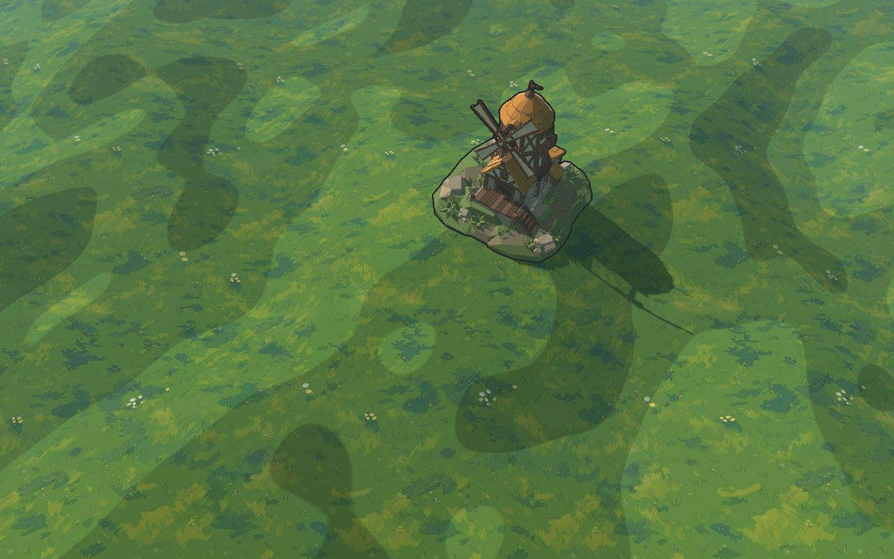
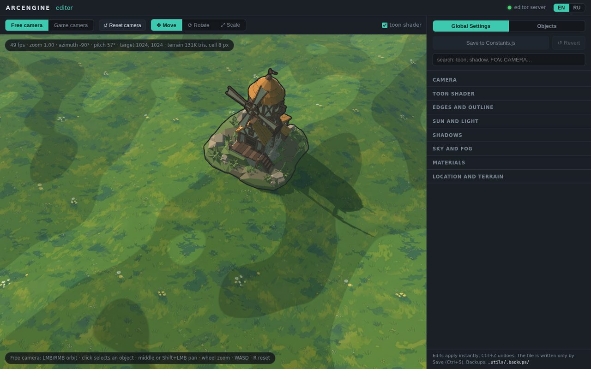

# ArcEngine

**An LLM-native starter kit for 3D browser games.** Plain JavaScript + [Babylon.js](https://www.babylonjs.com/), zero npm dependencies, no build step. It is built to be developed together with an AI coding agent such as Claude Code.



## What's inside

- **Game scene:** height-map terrain with hills, sky, sun, shadows, toon shader with edge and silhouette outlines, game camera, and FBX models placed from `js/Objects.js`.
- **Web editor (EN/RU):** the same world with free and game cameras, move/rotate/scale gizmos, and live **Global Settings** for camera, toon, outlines, light, shadows, fog, materials and terrain. It saves back into `js/Constants.js` with automatic backups. The **Objects** tab imports FBX models, edits their properties and adds simple part-rotation animation, saved to `js/Objects.js`.
- **Agent-ready:** `CLAUDE.md` lists the project invariants, and `claude/skills/` holds task-specific skills (world/rendering, editor, build/tools) that the agent reads before changing code.
- **Checks:** JSDoc type checking via `tsc` (run through `npx`, nothing installed) and unit tests with `node --test`.
- **Build:** a self-contained game archive, `dist/arcengine-<version>.zip`, with no external resources.



## Quick start

The only requirement is [Node.js](https://nodejs.org/) (LTS).

| Task | Windows | Linux / macOS |
|---|---|---|
| Run the game (port 8080) | `run.bat` | `node tools/dev-server.mjs` |
| Open the editor (port 8090) | `editor.bat` | `node _utils/editor/server.mjs` |
| Type check + tests | `check.bat` | `node tools/check.mjs` |
| Build a game archive | `build.bat` | `node tools/build.mjs` |

The game is at `http://localhost:8080/` and the editor at `http://localhost:8090/_utils/editor/`. If a port is busy, the next free one is used. The servers send `no-store`, so after editing a `.js` file a plain F5 is enough.

Don't open `index.html` directly or serve it with `python -m http.server`: the browser will cache old scripts.

## Working with an AI agent

Start the agent in the kit's root folder. `CLAUDE.md` is loaded automatically and points to the right skill for each part of the code:

| Area | Skill |
|---|---|
| `js/`: world, terrain, camera, models, lighting, toon, outlines | `claude/skills/world3d/SKILL.md` |
| `_utils/editor/`: editor, inspector, Objects tab, UI text | `claude/skills/editor/SKILL.md` |
| `tools/`, `tests/`, assets, build, type errors | `claude/skills/build/SKILL.md` |

After any code change, run `node tools/check.mjs`. It must pass.

`CLAUDE.md` and the skills are written in Russian. Current agents work with them as is.

## Project layout

```
index.html      canvas, loading screen, script order
js/             game code (classic scripts, globals): Constants, Objects, World3D,
                Terrain3D, Model3D, Location3D, CameraControl, main
libs/           babylon.js (9.26, local copy), simplex-noise.js
assets/         ground textures and FBX models
_utils/editor/  web editor (not part of the game build)
tools/          dev server, build, asset scanner, zip writer, checks
tests/          node --test unit tests
claude/         skills and a launch.json template for Claude Code
```

## Not included (yet)

Sound, physics, a UI framework, skeletal/texture animation (only part rotation), multiple scenes or levels, save games, and render/input tests.

## License

MIT, see [`LICENSE`](LICENSE). Bundled third-party libraries keep their own licenses.
