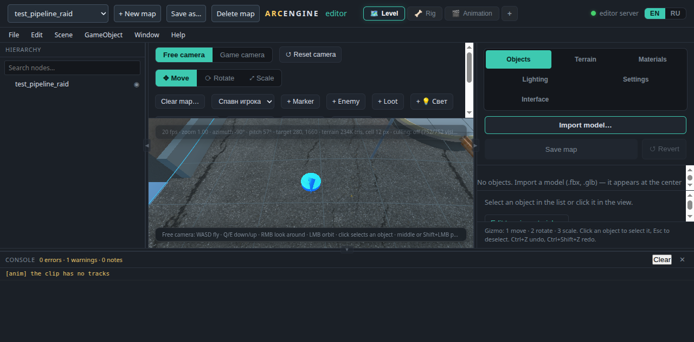
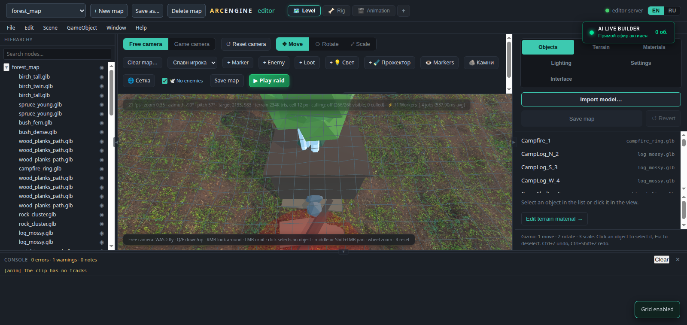
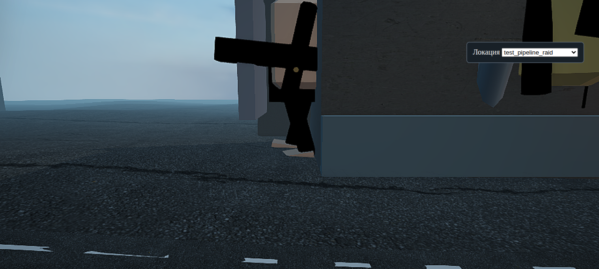
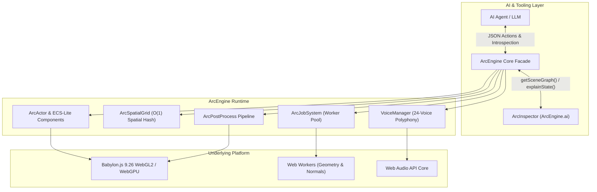

<div align="center">

# ⚡ ArcEngine

**AI-Native 3D Web Game Engine with ECS-Lite, WebGL 2.0 / WebGPU, Multithreaded Jobs, Spatial Hash Partitioning, Procedural Audio & Built-in 3D World Editor**

[](LICENSE)
[](https://github.com/dengabrielyan/ArcEngine)
[](https://github.com/dengabrielyan/ArcEngine)
[](https://github.com/dengabrielyan/ArcEngine)
[](https://github.com/dengabrielyan/ArcEngine/pulls)

[English](#features) • [Русский](#о-проекте) • [Quick Start](#quick-start) • [Architecture](#architecture) • [API Manual](ENGINE_API.md) • [Contributing](#contributing)

</div>

---

## Visual Showcase

<div align="center">

### In-Browser 3D World & Level Editor


### Real-Time Lighting, Shading & Terrain Sculpting


### Real-Time Post-Processing & Combat Pipeline


</div>

---

## Features

- 🧠 **AI-Native Introspection (`ArcInspector` / `ArcEngine.ai`)**: Built from the ground up for collaboration with AI agents and Large Language Models. Supports full runtime semantic state explanation, JSON scene graph dumps, and self-correcting validation loops.
- ⚡ **Declarative ECS-Lite (`ArcActor` & `ArcComponent`)**: Zero-boilerplate component architecture. Modular lifecycle hooks (`init`, `update`, `destroy`, `onMessage`) without overhead.
- 🌐 **$O(1)$ Spatial Hash Grid (`ArcSpatialGrid`)**: High-performance 2D/3D cell hashing, fast bounding box queries, radius queries, and ray traversal via DDA (Digital Differential Analyzer).
- 🧵 **Multi-Threaded Job System (`ArcJobSystem`)**: Offloads heavy terrain heightfield synthesis, surface normal calculations, and procedural geometry parsing to a pool of background Web Workers, keeping the main loop at a stable 60 FPS.
- 🎨 **AAA Post-Processing Pipeline (`ArcPostProcess`)**: Screen-Space Ambient Occlusion (SSAO2 with geometry buffers), HDR Bloom, Screen-Space Depth of Field, FXAA, Tone Mapping (ACES / Neutral), and distance-based shadow culling.
- 🔊 **Priority Audio Polyphony (`VoiceManager` & `ProceduralAudio`)**: Web Audio API core with a 24-voice budget, dynamic voice stealing (age/priority), 3D spatial panning, and procedural synthesizers (weapons, sirens, engines, weather).
- 🛠️ **Full In-Browser 3D Editor (`_utils/editor/`)**: Dockable layout manager, node hierarchy tree, visual transform gizmos (Translate/Rotate/Scale), lighting presets, terrain material blending, and live map persistence.
- 📦 **Zero External NPM Runtime Dependencies**: Runs out of the box with native ES2022+ modules and local Babylon.js 9.26 runtime. No bundlers or compilers required.

---

## Architecture

ArcEngine cleanly separates AI orchestration, game logic, multithreading, and physical rendering:



---

## Quick Start

### 1. Prerequisites
- **Node.js 18+** (no external npm packages required)
- Any modern web browser with WebGL 2.0 support (Chrome, Firefox, Edge, Safari)

### 2. Clone and Run
```bash
git clone https://github.com/dengabrielyan/ArcEngine.git
cd ArcEngine

# Start the built-in zero-dependency local development server
node tools/dev-server.mjs
```
The server will start at `http://127.0.0.1:8080/`.

### 3. Launching the 3D Editor
Open `http://127.0.0.1:8080/_utils/editor/` in your browser to launch the 3D scene editor, sculpt terrain, place lights, and configure levels.

### 4. Running the Automated Test Suite
ArcEngine includes an extensive test suite verifying physics, math, netcode, audio, multithreading, and shaders:
```bash
node tools/check.mjs
```

---

## Minimal Declarative Game (10 Lines)

ArcEngine allows creating complete interactive 3D simulations declaratively:

```javascript
import { ArcEngine } from './js/engine/ArcEngine.js';

const app = await ArcEngine.init({
    canvas: document.getElementById('renderCanvas'),
    spatialCellSize: 64,
    workers: { workerUrl: 'js/engine/workers/ArcJobWorker.js', maxWorkers: 4 }
});

app.spawnActor({
    id: 'hero',
    name: 'Operator',
    position: [0, 0, 0],
    components: [
        { type: 'MeshRenderer', shape: 'box', size: [2, 2, 2], color: '#38bdf8' },
        { type: 'ArcController', speed: 12 }
    ]
});
```

---

## Project Structure

```text
ArcEngine/
├── _utils/
│   └── editor/             # Complete in-browser 3D World & Level Editor
├── assets/                 # Meshes, audio clips, starter levels, textures
│   └── levels/             # Declarative starter scenes & map index
├── docs/                   # Developer guides and screenshots
│   └── images/             # Visual showcase assets
├── js/
│   ├── engine/             # ArcEngine Core Architecture
│   │   ├── ArcActor.js     # ECS-Lite Actor & Component system
│   │   ├── ArcEngine.js    # Central facade & lifecycle orchestrator
│   │   ├── ArcInspector.js # AI semantic introspection & scene diagnostics
│   │   ├── ArcJobSystem.js # Multithreaded Web Worker dispatcher
│   │   ├── ArcPostProcess.js # SSAO2, Bloom, DoF, FXAA post-processing
│   │   ├── ArcSpatialGrid.js # O(1) Spatial Hash Grid & DDA raycaster
│   │   └── workers/        # Background calculation workers
│   ├── audio/              # VoiceManager & sound synthesis
│   ├── World3D.js          # Babylon.js scene, shadow generator & lighting
│   ├── Terrain3D.js        # Dynamic heightfield terrain & normal updates
│   └── Game.js             # Gameplay simulation & actor controller
├── libs/                   # Local Babylon.js 9.26 runtime (zero-npm)
├── server/                 # Loopback simulation room & WebSocket transport
├── tests/                  # 840+ automated regression and unit tests
├── tools/                  # Built-in dev-server, asset scanner & test runner
├── ENGINE_API.md           # Comprehensive Engine API Reference Manual
├── LICENSE                 # MIT License
└── README.md               # Project overview
```

---

## О проекте (Russian Overview)

**ArcEngine** — это легковесный, автономный игровой 3D веб-движок, разработанный для быстрой разработки и взаимодействия с современными AI-агентами (LLM).

### Преимущества:
1. **Чистый стек без зависимостей:** Никаких тяжелых npm-пакетов, вебпаков или транспайлеров. Запускается напрямую в браузере и на стандартном Node.js сервере.
2. **Многопоточность на Web Workers:** Расчет высот террейна и нормалей выполняется в фоновом пуле потоков, исключая задержки главного потока.
3. **Продвинутая постобработка:** Встроенный пайплайн SSAO2 с геометрическими буферами, HDR Bloom, Depth of Field и динамическое отсечение теней.
4. **Встроенный 3D-редактор:** Полноценный визуальный редактор прямо в браузере (`_utils/editor/`) с поддержкой гизмо, расстановки объектов и настройки материалов.
5. **AI-интроспекция:** Механизм `ArcEngine.ai` позволяет ИИ-агентам мгновенно получать снимок сцены в JSON, находить аномалии и вносить изменения.

---

## Contributing

ArcEngine is open-source and welcomes community contributions!

1. **Fork the Project** (`https://github.com/dengabrielyan/ArcEngine/fork`).
2. **Create your Feature Branch** (`git checkout -b feature/AmazingFeature`).
3. **Ensure All Tests Pass** (`node tools/check.mjs`).
4. **Commit your Changes** (`git commit -m 'feat: Add AmazingFeature'`).
5. **Push to the Branch** (`git push origin feature/AmazingFeature`).
6. **Open a Pull Request** with a description of your changes.

Feel free to open an **[Issue](https://github.com/dengabrielyan/ArcEngine/issues)** for bug reports, suggestions, or performance improvements!

---

## License

Distributed under the **MIT License**. See [`LICENSE`](LICENSE) for more information.

Developed by [Daniel Gabrielyan](https://github.com/dengabrielyan) and ArcEngine Contributors.
