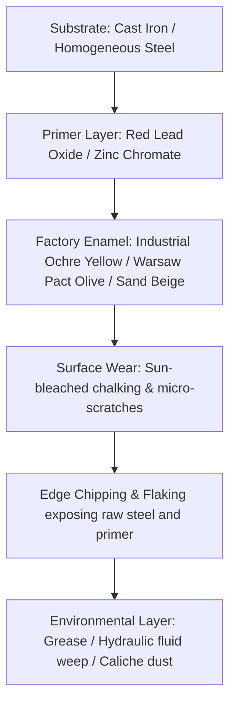

# ARC Machines: Art Direction & Visual Concept Briefs
**Style Paradigm:** Cassette Futurism (1978–1983) × Heavy Utilitarian Industrial  
**Role:** Senior 3D Artist & Art Director (AAA Pipeline: UE5, Nanite/Lumen, Substance 3D, Blender/Maya)  
**Target Project:** Extraction Shooter (ARC Raiders aesthetic)

---

## 1. Global Visual Bible & Aesthetic Foundation

### 1.1 The Core Aesthetic Pillars
The ARC machines are not sleek, sterile, Apple-like sci-fi constructs, nor are they formless cyberpunk scrap heaps. They look like **late 1970s and early 1980s heavy industrial machinery** designed by brutalist civil-defense engineers to survive planetary mining, nuclear fallout, and long-term harsh autonomous operations.

```
┌─────────────────────────────────────────────────────────────────────────┐
│                           AESTHETIC PILLARS                             │
├────────────────────────────────┬────────────────────────────────────────┤
│ CASSETTE FUTURISM (1978–1984)  │ • Beveled stamped-sheet metal casings  │
│                                │ • CRT monitors behind reinforced glass │
│                                │ • Heavy rotary switches, chunky dials  │
│                                │ • Convex, thick-glass optical lenses   │
├────────────────────────────────┼────────────────────────────────────────┤
│ HEAVY UTILITARIAN INDUSTRIAL   │ • Cast iron, rolled plate, oxy-welds   │
│                                │ • Visible double-acting hydraulic rams │
│                                │ • External high-pressure braided hoses │
│                                │ • Lift lugs, crane hooks, tow shackles │
├────────────────────────────────┼────────────────────────────────────────┤
│ BRUTALIST FUNCTIONAL HORROR    │ • Faceless sensor blisters & cyclopses │
│                                │ • Audio sirens, mechanical ratchets    │
│                                │ • Zero "magic" floaters or antigravity │
│                                │ • Relentless weight and raw momentum   │
└────────────────────────────────┴────────────────────────────────────────┘
```

> **Zero Magic Rule:** Every moving part must have a visible mechanical reason to exist: a hydraulic piston, a heavy-duty rotary actuator, a leaf spring, or a planetary gear hub. No hovering segments, no force-field emitters, no seamless smooth glossy white shells.

---

### 1.2 Color Palette & Material Wear Stack (PBR Pipeline)



1. **Base Metal (Albedo/Metallic/Roughness):**
   - Rough rolled armor plate and cast iron. Roughness: `0.58 – 0.78`, Metallic: `1.0`. Subtle cast pebble noise map (`Detail Normal`, 0.05 scale).
2. **Primer Intermediate Layer:**
   - Red lead oxide (`#822A1E`) or zinc chromate yellow-green (`#8C8433`). Visible only at paint transition borders where paint flakes before reaching bare steel.
3. **Topcoat Factory Enamel:**
   - Heavy industrial stove enamel.
   - *Primary Yellow-Orange Palette:* Caterpillar/Komatsu industrial yellow (`#D49B23`), sun-faded to pale ochre.
   - *Military Olive Drab:* Faded Soviet-era green (`#4A4E3B`).
   - *Civil Defense Cream:* Yellowed off-white / bone beige (`#CFC8B2`).
   - Roughness: `0.42 – 0.65`.
4. **Mechanical Lubricants & Hydraulic Fluid:**
   - Deep amber/black mineral moly grease around ball joints, linear bearings, and piston rods.
   - Roughness: `0.08 – 0.18` (wet glossiness), Metallic: `0.0`.
5. **Detail Normal & Decal System:**
   - Stenciled Helvetica/DIN warning labels, high-voltage lightning bolts, yellow/black 45° chevron hazard bands, cast foundry casting marks (e.g. `ARC-79-KEM`, `PRESS 4500 PSI`).

---

### 1.3 Visual Hierarchy & Weak Spot Readability (Silhouette Rules)
In high-stress extraction firefights, players have **250–500 milliseconds** to evaluate range, threat level, and lethal target points.

* **Primary Form (Mass & Silhouette):** Recognizable at 100m+ in silhouette alone against dust storms, sunset glare, or silhouetted against ruined skylines.
* **Secondary Form (Mechanical articulation & Weapon Mounts):** Communicates weapon trajectory, traversal speed, and firing intentions.
* **Tertiary Form (Hoses, Louvers, Gauges, Fasteners):** Grounded realism up close (1–10m).
* **Weak Spots (High Contrast & Thermal Emissivity):**
  - **Incandescent Cooling Louvers / Heat Radiators:** Deep orange/amber thermal glow (`540nm–610nm`, Emissive multiplier `12–25 cd/m²`).
  - **Optical Sensor Lenses:** Bulging convex fish-eye glass lenses with amber/cyan anti-reflective coating. High specular hot-spot.
  - **Pressurized Fuel / Hydraulic Accumulators:** Cylindrical tanks wrapped in steel safety wire, high-contrast yellow/black hazard collars.

---

## 2. Detailed 3D Visual Briefs for the 8 ARC Machine Archetypes

---

### 1. «Сверчок» (Cricket / Skitter) — Prowling Swarm Leaper / Kamikaze

```
         [ Convex Lens Eye ]
              \       /
     ┌─────────▼─────▼─────────┐
     │  Angle-Faceted Head     │====[ Arming Strobe ]
     │  Pressure Gauge & Fuze  │
     └───┬─────────────────┬───┘
         │ [Pneumo-Spring] │
    ┌────┴─────────────────┴────┐
    │  Underslung Shaped-Charge  │◄── WEAK SPOT (Detonation Tank)
    └────┬─────────────────┬────┘
        / \               / \
     (Inverted Hydraulic Leg Assemblies)
```

#### 1. Silhouette & Forms
* **Primary (100m+):** Low-slung, hunched insectoid trapezoid with rearward-canted reversed knee joints. Looks like an aggressive mechanical flea or crouched trench mortar ready to snap forward.
* **Secondary:** Oversized pneumatic-hydraulic launch cylinder mounted diagonally along the spine; pointed shape-charge warhead nose cone protruding from the undercarriage.
* **Tertiary:** External coiled brake line hoses, mechanical impact fuze probe with a safety pin pull-ring, analog dial pressure gauge (0–300 Bar), stamped chassis serial code.

#### 2. Mechanical Assemblies & Functional Kinematics
* **Leap Actuator:** High-pressure nitrogen gas accumulator with a mechanical dog-clutch trip latch. Legs compress downward with a ratcheting audio click, then release violently to catapult the drone 15–20 meters through the air.
* **Attitude Thrusters:** Three small cold-gas steering nozzles with solenoid valves on the dorsal plate for mid-air stabilization.
* **Ground Stabs:** Twin pointed carbide-tipped foot claws designed to bite into dry caliche, concrete, and rock.

#### 3. PBR Materials & Wear Pipeline
* **Base:** Stamped 4mm cold-rolled steel shell finished in oxidized olive-drab with peeling primer edges.
* **Leg Mechanisms:** Cadmium-plated high-tensile spring steel, blued cylinder barrels with silver score lines from reciprocating piston travel.
* **Wear Layer:** Heavy dust caked into recessed bolt heads, carbon blast marks around the directional gas vents, spatters of dried mud.

#### 4. Visual Readability & Vulnerabilities
* **Primary Weak Spot:** Underbelly **pressurized nitrogen/fuel canister**. Painted safety red with yellow warning band; turns glowing incandescent amber-orange right before the suicidal launch.
* **Secondary Weak Spot:** Bulging convex camera lens (size: 90mm diameter) on the front snout. A direct hit causes blind disorientation or early detonation.

#### 5. Technical Specifications (3D / Rigging / VFX)
* **Target Budget:** 18,000 – 24,000 tris (or Nanite proxy: 85,000 tris).
* **Texel Density:** 20.48 px/cm on a single 2K PBR texture set (ORM + Normal + Albedo + Emissive).
* **Rigging:** 16 bones (Root, Pelvis, 3 bones per leg × 2, PneumoPiston_Base, PneumoPiston_Rod, NoseSensor, WarheadArm).
* **Sockets:** `FX_JumpExhaust`, `FX_SensorEye`, `FX_DetonationCore`, `FX_PressureVent`, `Audio_RatchetTension`.

#### 6. Concept Art Generation Prompt
```text
Production concept art of a terrifying swarm suicide drone robot called 'Cricket', ARC Raiders aesthetic, Cassette Futurism 1979 style, heavy utilitarian industrial retro-sci-fi. Low-slung hunched insectoid silhouette, mechanical flea posture, inverted heavy hydraulic jumping legs, compressed nitrogen cylinder on back, exposed high-pressure rubber braided hoses, analog circular pressure gauge with needle dial, stamped olive drab steel plates with paint chipping revealing red lead oxide primer. Underslung explosive shaped-charge core with exposed safety pins. Convex amber glass camera lens on front. Dusty sun-bleached desert quarry setting, harsh directional industrial lighting, Syd Mead, Chris Foss, Ron Cobb concept art style, cinematic 35mm film photography, 8k resolution, photorealistic mechanical detail --ar 16:9
```

---

### 2. «Фонарщик» (Spotter / Lens) — Aerial Recon Drone & Alarm Broadcaster

```
               [ Flared Siren Bell ]
                     │     │
         ┌───────────┴─────┴───────────┐
  [====] │  Toroidal Ducted Fan Pod    │ [====]
  [FAN ] │  Exposed Stator Vanes       │ [FAN ]
  [====] └───────────┬─────┬───────────┘ [====]
                     │  O  │◄── Rear Radiator Vent (WEAK SPOT)
             ┌───────┴─────┴───────┐
             │  CYCLOPEAN EYE POD  │◄── WEAK SPOT (Main Lens)
             │  Convex Glass Lens  │
             └─────────────────────┘
```

#### 1. Silhouette & Forms
* **Primary (100m+):** Distinctive dumbbell/torus floating profile dominated by two tilting ducted fan nacelles and a huge hanging spherical cyclopean eye pod beneath.
* **Secondary:** Exposed stator guide vanes inside the fan ducts; flared cast-aluminum siren trumpet mounted on top; trailing whip antenna oscillating in the downwash.
* **Tertiary:** Wire-mesh lens protector grill, heavy rubber shock mounts, external oil sight-glasses on the rotor gearboxes, riveted duralumin cowl plates with Dzus fasteners.

#### 2. Mechanical Assemblies & Functional Kinematics
* **Propulsion:** Twin ducted fans with variable-pitch rotor blades driven by enclosed shaft drives from a central turbine pod. Nacelles tilt ±50° for rapid translation and braking.
* **Sensor Gimbal:** 2-axis heavy-duty worm-drive gimbal holding the 320mm spherical optical housing with visible rubber bellows protecting the rotary joints.
* **Siren Mechanism:** Mechanical chopper-siren housing with radial stator slots driven by an auxiliary 12V motor, producing a terrifying wailing warble.

#### 3. PBR Materials & Wear Pipeline
* **Fuselage:** Sun-bleached industrial equipment yellow (`#D49B23`) with faded black 45-degree hazard stripes across duct lips.
* **Glass Lens:** Multi-coated optical glass with internal concentric Fresnel rings and deep chromatic aberration at grazing angles.
* **Wear Layer:** Jet-fuel soot staining trailing edges of engine exhausts, chipped paint on leading cowl edges from airborne gravel, dripping grease from rotor pitch links.

#### 4. Visual Readability & Vulnerabilities
* **Primary Weak Spot:** The **central cyclopean lens**. When scanning, it casts a stark 40-degree volumetric searchlight beam; shooting the lens blinds the unit and crashes its stabilization computer.
* **Secondary Weak Spot:** The **rear thermal exhaust radiator grill** between the fan ducts, glowing fierce orange-red when hovering under high throttle.

#### 5. Technical Specifications (3D / Rigging / VFX)
* **Target Budget:** 32,000 – 42,000 tris; 1x 4K PBR texture set (or 2x 2K split: Frame/Rotor + Eye/Siren).
* **Texel Density:** 20.48 px/cm.
* **Rigging:** 14 bones (Root, LeftFanTilt, RightFanTilt, LeftRotorSpin, RightRotorSpin, Vanes_Pitch, Gimbal_Yaw, Gimbal_Pitch, SirenChopper, Antenna_01..04).
* **Sockets:** `FX_Searchlight_Beam`, `FX_Lens_Flares`, `FX_Thruster_Downwash_L/R`, `FX_Radiator_Glow`, `Audio_Siren_Emitter`.

#### 6. Concept Art Generation Prompt
```text
Full-view cinematic concept design of an ominous hovering surveillance drone called 'Spotter', ARC Raiders and Cassette Futurism aesthetic, late 70s brutalist industrial design. Dual tilting ducted fan cowlings with rotating blades behind protective wire grates, heavy stamped aluminum housing in faded Caterpillar yellow with worn hazard stripes. Suspended underneath is a massive spherical cyclopean camera eye made of thick convex Fresnel glass emitting a blinding warm halogen volumetric spotlight. Top-mounted cast bronze mechanical air-raid siren bell. Trailing antenna and exposed hydraulic gimbal wiring harnesses. Floating above an abandoned sun-bleached Soviet modernist industrial concrete complex, dusty atmospheric hazing, Chris Foss, Syd Mead, Ron Cobb style, high-end production art, 8k --ar 16:9
```

---

### 3. «Гончая» (Stalker / Hound) — Bipedal Hydraulic Hunter-Patrol

```
                  [ Boxy Filter Snorkel ]
                        │        │
               ┌────────┴────────┴────────┐
               │  Hunched Torso Chassis   │
               │  [ Twin Offset Lenses ]  │
               └───┬──────────────────┬───┘
                   │  (Torso Ring)    │
            ┌──────┴──────────────────┴──────┐
            │ UNDERSLUNG DRUM ROTARY CANNON  │
            └──────────────┬─────────────────┘
                          / \
       [ Exposed Double-Acting Hydraulic Cylinders ]
                        /     \
                (Digitigrade Raptor Legs)
```

#### 1. Silhouette & Forms
* **Primary (100m+):** Fast-moving, forward-raked digitigrade biped. Severe hunchbacked silhouette with the head recessed between muscular shoulder armor humps; underslung heavy drum magazine.
* **Secondary:** Prominent twin chrome hydraulic piston rams running parallel to the tibia; boxy rectangular air-cleaner housing with mushroom caps on the upper back.
* **Tertiary:** Braided hydraulic hoses anchored with rubber clamps and steel zip-cables; link-ejection chute on the gun; analog 3-digit mechanical round counter on the receiver box.

#### 2. Mechanical Assemblies & Functional Kinematics
* **Leg Articulation:** Digitigrade bipedal kinematics with heavy cast-steel knee yokes, double-acting push-pull hydraulic rams, and vulcanized rubber bump-stops at maximum extension.
* **Weapon Traverse:** The underslung gun pod is slung on a powered 2-axis pintle below the pelvic mount, allowing ±25° independent aim without turning the legs.
* **Cooling Cycle:** Automatic cooling louvers on the rear engine hump open under sustained sprint or firing, ejecting plumes of pressurized steam.

#### 3. PBR Materials & Wear Pipeline
* **Chassis Armor:** Warsaw-Pact battleship gray (`#5B6366`) over dark red primer. Heavy oxy-acetylene torch bevels and visible chunky weld beads along hull seams.
* **Hydraulic Pistons:** Mirror-polished hard chromium plating with micro-scratches along the axis of stroke and dark grease rings around the rod wipers.
* **Gun Metal:** Parkerized carbon steel with silver edge rub on the receiver, heat-blued barrel tip from continuous auto-fire.

#### 4. Visual Readability & Vulnerabilities
* **Primary Weak Spot:** The **underslung ammunition drum** mounted directly beneath the torso. A high-contrast target with stamped warning chevrons; piercing it causes ammo cook-off and staggers the bot.
* **Secondary Weak Spot:** **Knee joint hydraulic control valves**. Unprotected from the rear; hitting them cripples leg speed and forces a limping gait.
* **Tertiary:** The **dorsal cooling louvers** which pulse with glowing orange radiator heat during sprint phases.

#### 5. Technical Specifications (3D / Rigging / VFX)
* **Target Budget:** 48,000 – 62,000 tris; 2x 4K PBR texture sets (Set 1: Chassis & Legs; Set 2: Engine, Weapon & Hydraulics).
* **Texel Density:** 20.48 px/cm.
* **Rigging:** 34 bones (Pelvis, Spine, TorsoYaw, 5 bones per leg including piston look-at constraints, GunMount, BarrelSpin, AmmoFeedChute, 4x RadiatorFlaps).
* **Sockets:** `FX_MuzzleFlash`, `FX_ShellEject`, `FX_HydraulicBurst_L/R`, `FX_DorsalSteamVent`, `Audio_FootstepHeavyMetal`.

#### 6. Concept Art Generation Prompt
```text
Detailed concept art of an agile bipedal mechanical hunter robot named 'Stalker', ARC Raiders and Alien 1979 aesthetic, Cassette Futurism and rugged industrial military design. Forward-leaning digitigrade running posture, raptor-like legs with massive exposed chrome hydraulic pistons and flexible high-pressure hoses. Hunched armored torso with twin stereoscopic rangefinder glass lenses glowing faint green. Underslung heavy multi-barrel rotary autocannon fed by a huge circular drum magazine with exposed linked ammunition belts. Weathered battleship gray steel armor with crude welding seams, chipped paint over red oxide primer, dripping oil around joints. Set in a desolate open-pit gravel quarry, dramatic low-angle shot, Ron Cobb, Syd Mead, crisp mechanical details, volumetric dust, 8k --ar 16:9
```

---

### 4. «Бастион» (Bulwark / Bastion) — Quadrupedal Heavy Defense Platform

```
                  ┌──────────────────────┐
                  │ 30mm Autocannon Pod  │
                  └──────────┬───────────┘
               ┌─────────────┴─────────────┐
               │    CAST SLOPED TURRET     │
  [PIONEER]    │  [Slit Viewport / Prism]  │
  [TOOLS  ]    └─────────────┬─────────────┘
            ┌────────────────┴────────────────┐
            │   PYRAMIDAL HULL CASING         │
            │   Cast Stencil: "ARC-UR-81"     │
            └──────┬────────────────────┬─────┘
                  / \                  / \
        (Armored Outrigger)     (Armored Outrigger)
        [Recoil Ground Spade]   [Recoil Ground Spade]
```

#### 1. Silhouette & Forms
* **Primary (100m+):** Broad, squat quadrupedal fortress. Pyramid-like sloped profile with wide outrigger stance, resembling a mobile WWII bunker or cast-steel tank turret on four heavy legs.
* **Secondary:** Long heavy-caliber autocannon barrel with a perforated muzzle brake; four massive angular knee-cowling shields protecting leg joints.
* **Tertiary:** Heavy lifting lugs, cast serial number plates (`ARC-UR-81`), pioneer tools (crowbar, sledgehammer) clamped to the hull brackets, towing clevis shackles on corner bumpers.

#### 2. Mechanical Assemblies & Functional Kinematics
* **Ground Anchoring:** When preparing for rapid autocannon volleys, pneumatic rams drive four heavy ground-spades (recoil anchors) into the soil, visibly shaking the terrain.
* **Turret Rotation:** 360-degree ball-bearing ring with external spur-gear teeth visibly meshing with a hydraulic drive motor on the hull deck.
* **Suspension:** Heavy swinging trailing-arm suspension with enclosed nitrogen springs and exposed rubber bump-stop pucks.

#### 3. PBR Materials & Wear Pipeline
* **Armor Casting:** Rough pebbled surface texture replicating sand-cast steel with casting seams and raised foundry markings.
* **Paintwork:** Faded industrial orange (`#C76618`) over dark gray primer, with white stenciled military nomenclature and yellow-black stripes on leg calves.
* **Wear Layer:** Severe ballistic gouges and ricochet scrapes exposing bright polished steel cores, dry dirt encrusted along lower hull skirts.

#### 4. Visual Readability & Vulnerabilities
* **Primary Weak Spot:** The **rear engine / powerpack bay**. Protected only by slotted louvers that glow bright incandescent orange (`650°C`) from internal gas-turbine heat exchangers.
* **Secondary Weak Spot:** The **turret ring gap**. A well-placed round jams turret traversal.
* **Tertiary Weak Spot:** **Knee joint actuators** when the legs lift to take a step, momentarily exposing unarmored hydraulic seals.

#### 5. Technical Specifications (3D / Rigging / VFX)
* **Target Budget:** 75,000 – 95,000 tris (Nanite asset: 250,000 tris); 3x 4K PBR texture sets (Turret/Gun, Main Hull/Engine, Leg Assemblies).
* **Texel Density:** 20.48 px/cm.
* **Rigging:** 28 bones (HullRoot, TurretYaw, GunPitch, 4 legs × 5 bones each including spade deployment).
* **Sockets:** `FX_Autocannon_Muzzle`, `FX_Breech_Smoke`, `FX_Spade_Impact_01..04`, `FX_Turbine_Exhaust`, `FX_TurretRing_Sparks`.

#### 6. Concept Art Generation Prompt
```text
Concept artwork of a massive quadrupedal walking tank robot called 'Bastion', ARC Raiders style, 1980s retro-futuristic utilitarian heavy industrial. Low-slung pyramidal bunker-like cast steel body mounted on four wide armored walking legs with deployed hydraulic ground-spades digging into dirt. Heavy 35mm long-barrel autocannon in a low-profile cast turret with perforated muzzle brake. Faded safety orange paint worn down to raw rough cast iron, white industrial stencils 'ARC-81-HEAVY', heavy grease stains around visible gear rings and hydraulic rams. Soviet brutalist aesthetic mixed with Caterpillar heavy machinery. Sun-drenched rocky extraction zone background, smoke and heat distortion, Syd Mead, Chris Foss, masterwork cinematic framing, 8k --ar 16:9
```

---

### 5. «Глашатай» (Screamer / Broadcaster) — Electronic Warfare & Jamming Tripod

```
                    (((( 360° RADAR HORN ))))
                               │
               ▲               ▼               ▲
             [MEGA]    [PARABOLIC DISH]      [MEGA]
             [PHONE]   [Wire-Mesh Mesh]      [PHONE]
               ▼               │               ▼
            ┌──────────────────┴──────────────────┐
            │  ELECTRONICS RACK / VACUUM TUBES    │◄── WEAK SPOT (Tubes)
            │  Oscilloscope CRT behind Wire Cage  │
            └──────────────────┬──────────────────┘
            │  Battery / Capacitors Bank          │◄── WEAK SPOT (Caps)
            └──────────────────┬──────────────────┘
                              /|\
                  (Spindly Telescopic Tripod)
```

#### 1. Silhouette & Forms
* **Primary (100m+):** Tall, spindly, unsettling tripod silhouette topped by an asymmetrical cluster of megaphone horns, rotating radar antennas, and an articulated wire-mesh parabolic dish.
* **Secondary:** Pneumatic telescoping mast that elevates the sensor head; rear-mounted open-frame rack containing glowing vacuum tubes and amplifier coils behind steel mesh.
* **Tertiary:** Swaying thick coaxial cables tied off with tarred cord, spring-base whip antennas oscillating in the wind, small round green-phosphor CRT screen displaying pulsing audio waveforms.

#### 2. Mechanical Assemblies & Functional Kinematics
* **Broadcast Deployment:** When initiating an area jam or summoning reinforcements, the legs splay wider and the center mast pneumatically extends 2 meters higher with a loud hissing exhaust.
* **Acoustic Projectors:** Array of 6 cast-aluminum megaphone bells mounted radially on servo gimbals that violently oscillate back and forth during sonic disruption attacks.
* **Emitter Dish:** Motorized 1.2-meter wire-mesh parabolic reflector dish that continuously rotates and pitches to sweep radio frequencies.

#### 3. PBR Materials & Wear Pipeline
* **Cabinetry:** Stamped sheet metal panels finished in utilitarian military beige (`#C8B896`) with scratched ham-radio style lettering.
* **Audio Horns:** Cast aluminum with oxidized chalky white surface corrosion and water drips.
* **Electronics:** Tarnished copper heat pipes, blued steel chassis frames, amber vacuum tubes with filament glow behind protective wire cages.

#### 4. Visual Readability & Vulnerabilities
* **Primary Weak Spot:** The **vacuum-tube amplifier array** on the rear electronics bay. Highly fragile; glows with warm golden light. Cracking the glass tubes short-circuits the jamming field.
* **Secondary Weak Spot:** The **high-voltage capacitor bank** on the lower pelvis. Puncturing it causes an explosive electrical discharge that damages nearby ARC units.

#### 5. Technical Specifications (3D / Rigging / VFX)
* **Target Budget:** 42,000 – 55,000 tris; 2x 4K PBR texture sets (Mast/Antennas/Speakers + Chassis/Legs/Electronics).
* **Texel Density:** 20.48 px/cm.
* **Rigging:** 26 bones (Root, MastExtend_01..03, Dish_Yaw/Pitch, 6x Megaphone gimbal bones, 3x Tripod legs, CoaxialCable splines).
* **Sockets:** `FX_JammingField_Center`, `FX_SonicShockwave_01..06`, `FX_TubeSpark_01..04`, `FX_CapacitorExplode`, `Audio_EarsplittingSiren`.

#### 6. Concept Art Generation Prompt
```text
Full-body concept art of an eerie electronic warfare robot called 'Screamer', Cassette Futurism 1980s, ARC Raiders retro-industrial style. Tall spindly tripod walking frame with a telescoping central mast supporting a rotating wire-mesh parabolic dish antenna and an array of six weathered aluminum megaphone horn loudspeakers. Rear open-chassis electronic rack housing glowing glass vacuum tubes, exposed copper cooling pipes, and an analog green phosphor CRT oscilloscope screen behind a protective steel wire cage. Stamped beige steel chassis with faded frequency stencil markings, dangling coaxial cables with zip ties. Desert canyon landscape, dusk lighting, Ron Cobb, Syd Mead, Moebius influence, photorealistic render, 8k --ar 16:9
```

---

### 6. «Утилизатор» (Harvester / Sump) — Tracked Industrial Scavenger & Crusher

```
                   [ Heavy Hydraulic Boom Crane ]
                               │
                       [ 3-Jaw Grabber Claw ]
                               │
       ┌───────────────────────┴───────────────────────┐
       │ DIESEL-TURBINE PACK    [ REAR SHREDDER HOPPER ]◄── WEAK SPOT
       │ Twin Vertical Stacks   [ Rotating Steel Teeth ]
       ├───────────────────────────────────────────────┤
       │ ARMORED BULLDOZER CHASSIS                     │
       │ Front Heavy V-Plow / Dozer Blade              │
       └───────────┬───────────────────────┬───────────┘
               [=== TRACKED BOGIE ===] [=== TRACKED BOGIE ===]
```

#### 1. Silhouette & Forms
* **Primary (100m+):** Chunky, hulking tracked bulldozer mass with a massive asymmetric excavator crane arm mounted on one side and twin smoking exhaust chimneys rising from the opposite side.
* **Secondary:** Heavy front-mounted dozer plow blade with welded Ripper teeth; top-mounted open hopper containing counter-rotating shredder drums.
* **Tertiary:** Steel mesh debris guards over all intake ports, grease drip collection pans beneath the track drive sprockets, safety grab rails painted faded yellow, emergency fuel shutoff T-handle.

#### 2. Mechanical Assemblies & Functional Kinematics
* **Boom Arm & Claw:** 3-stage heavy hydraulic telescoping excavator arm terminating in a 3-jaw industrial demolition grabber with serrated manganese-steel jaws.
* **Track Drive:** Heavy caterpillar track bogies with individual hydraulic drive motors, oscillating bogie wheels, and grease-adjusted coil tensioners.
* **Crusher Chamber:** Intermeshing counter-rotating rotary crusher drums inside the cargo hopper that grind collected battlefield scrap.

#### 3. PBR Materials & Wear Pipeline
* **Plates & Plow:** 25mm thick rolled structural steel with heavy gouges, torch-cut edges, and bare burnished steel where rocks scrape against the plow blade.
* **Paint:** Flaking Komatsu yellow (`#E8A217`) over red iron oxide primer, heavily coated with diesel exhaust soot, oil streaks, and dried clay splatters.
* **Tracks:** Cast manganese steel links with polished contact ridges and heavy orange surface rust in the track crevices.

#### 4. Visual Readability & Vulnerabilities
* **Primary Weak Spot:** The **external hydraulic reservoir tank** mounted behind the crane cab. High-pressure sight gauge, painted safety yellow; bursting it sprays high-pressure flammable fluid and stalls the claw arm.
* **Secondary Weak Spot:** The **shredder hopper entrance** on the rear deck. Tossing an explosive or grenade into the spinning teeth destroys the engine drive belt.
* **Mobility Kill:** Shooting the front drive sprocket pins detaches the track tread, locking one side into a spin.

#### 5. Technical Specifications (3D / Rigging / VFX)
* **Target Budget:** 85,000 – 115,000 tris (Nanite asset: 320,000 tris); 4x 4K PBR texture sets (Track/Bogies, Main Chassis/Plow, Crane/Claw, Engine/Hopper).
* **Texel Density:** 15.36 px/cm (heavy vehicle scale).
* **Rigging:** 42 bones (HullRoot, 2x TrackUV controllers, Plow_Lift, CraneBase_Yaw, Boom_Pitch, Arm_Pitch, Wrist_Rot, 3x ClawJaws, ShredderDrums_Rot, ExhaustFlaps).
* **Sockets:** `FX_ExhaustSmoke_L/R`, `FX_HydraulicRupture`, `FX_CrusherSparks`, `FX_ClawGrip`, `Audio_DieselRumble_Loop`.

#### 6. Concept Art Generation Prompt
```text
Cinematic concept art of a brutal heavy tracked salvage machine called 'Harvester', ARC Raiders and Cassette Futurism aesthetic, late 1970s Caterpillar heavy industrial design. Massive rusted tracked bulldozer chassis with an asymmetric heavy-duty hydraulic excavator boom arm ending in a terrifying three-jaw scrap grabber claw. Front-mounted angled dozer blade with welded steel teeth. Twin vertical exhaust stacks puffing black diesel smoke, open-top hopper with visible rotating crusher shredder teeth. Weathered peeling safety yellow paint, grease drips, heavy mud cakes, warning labels in bold block typography. Abandoned open-pit strip mine setting, overcast gritty lighting, Syd Mead, Chris Foss, Ron Cobb, hyper-detailed mechanical textures, 8k --ar 16:9
```

---

### 7. «Бомбардир» (Bombard / Mortar) — Tripod Siege Artillery Walker

```
                      [ 280mm HEAVY MORTAR TUBE ]
                                  │   ▲
                       [ Recoil Slide Pistons ]
                                  │   ▼
            ┌─────────────────────┴─────────────────────┐
            │       BREECH BLOCK & ELEVATION QUADRANT    │
            │       Engraved Brass Elevation Dial       │
            └───────────┬───────────────────┬───────────┘
                        │ [ ROTARY CAROUSEL ]◄── WEAK SPOT (Shell Rack)
            ┌───────────┴───────────────────┴───────────┐
            │   TRIPOD ARTILLERY TURNTABLE              │
            └──────────┬─────────────────────┬──────────┘
                      /|\                   /|\
              (Hydraulic Outriggers with Ground Claws)
```

#### 1. Silhouette & Forms
* **Primary (100m+):** Massive triangular tripod base centered around an imposing, high-angle heavy mortar barrel (280mm caliber) aimed at the sky like an industrial forge press.
* **Secondary:** Two enormous parallel hydraulic recoil recuperators flanking the main tube; rear-mounted open rotary carousel magazine carrying cylindrical mortar shells.
* **Tertiary:** Circular spirit-level bubble vials on leg mounts, large handwheel dials with brass degree graduations, pneumatically operated sliding breech wedge with grease grooves.

#### 2. Mechanical Assemblies & Functional Kinematics
* **Elevation & Traverse:** Heavy worm-screw elevation gear driven by a dual-cylinder hydraulic motor; manual azimuth traverse ring with visible locking friction clamps.
* **Loading Cycle:** Mechanical overhead transfer arm grabs a 280mm projectile from the rear vertical drum carousel and rams it into the top-loading muzzle or sliding breech with a resounding pneumatic thud.
* **Recoil Stroke:** When firing, the barrel recoils 600mm backward along guide rails, expelling high-pressure nitrogen gas and superheated vapor from lateral bypass ports.

#### 3. PBR Materials & Wear Pipeline
* **Mortar Barrel:** Forged carbon gun steel with dark chemical bluing; rainbow temper rings (straw, violet, deep blue) around the muzzle blast collar from extreme firing temperatures.
* **Mounting Frame:** Cast iron chassis finished in weathered olive drab (`#3E4436`) with stamped Cyrillic/DIN measurement scales.
* **Wear Layer:** Burnt powder soot caked around the breech seal, flaked paint around high-stress leg pivots, yellow molybdenum grease covering elevation gear teeth.

#### 4. Visual Readability & Vulnerabilities
* **Primary Weak Spot:** The **open shell carousel** during reload cycles. Shooting an exposed projectile detonates the magazine, obliterating the artillery unit.
* **Secondary Weak Spot:** The **pneumatic elevation recuperators**. Puncturing them causes the barrel to lose elevation and slam down into its rest stop.
* **Firing Indicator:** Pre-fire muzzle vents vent superheated orange sparks 1.5 seconds before launch, giving raiders a visual cue to seek cover.

#### 5. Technical Specifications (3D / Rigging / VFX)
* **Target Budget:** 65,000 – 80,000 tris; 3x 4K PBR texture sets (Barrel/Recoil, Turntable/Carousel, Tripod Legs).
* **Texel Density:** 20.48 px/cm.
* **Rigging:** 25 bones (TripodBase, TurntableYaw, BarrelElevation, RecoilPiston, BreechSlide, ShellCarousel_Rot, RammerArm_01..03, 3x OutriggerSpades).
* **Sockets:** `FX_Mortar_MuzzleBlast`, `FX_BreechGas_Vent`, `FX_RecoilRecuperator_Steam`, `FX_Carousel_AmmoDetonation`, `Audio_ArtilleryBoom_Far`.

#### 6. Concept Art Generation Prompt
```text
Concept design of a walking heavy artillery robot called 'Bombard', ARC Raiders aesthetic, 1980s retro-futuristic utilitarian industrial war machine. Massive tripod walking legs anchored into bedrock with heavy hydraulic outrigger foot-pads. A huge 280mm short-barrel siege mortar pointed upwards at a 65-degree angle, flanked by massive hydraulic recoil cylinders. Rear open-cage rotary autoloader carousel holding large cylindrical mortar shells with exposed copper driving bands. Dark forged steel barrel with blue-violet heat temper discoloration near the muzzle, cast iron chassis in flaking Soviet military green, brass angle measuring dials, thick grease on gears. Desert quarry bombardment position, atmospheric smoke plumes, Ron Cobb, Syd Mead, Chris Foss, cinematic 8k --ar 16:9
```

---

### 8. «Колосс» (Goliath / Titan) — Walking Industrial Boss Colossus (35m Tall)

```
                       [ MAST CABIN / ROTATING BEACONS ]
                                     │
                   ┌─────────────────┴─────────────────┐
                   │   GANTRY CRANE TRUSS SHOULDERS    │
  [HEAVY ROTARY ]  │   Catwalks with Safety Railings   │  [HEAVY ROTARY ]
  [CANNON POD   ]  ├───────────────────────────────────┤  [CANNON POD   ]
  [SPONSON      ]  │   BLAST-FURNACE REACTOR TORSO     │  [SPONSON      ]
                   │   [ THERMAL RADIATOR LOUVERS ]    │◄── WEAK SPOT (Vents)
                   └──────────┬─────────────┬──────────┘
                              │ (HIP RING)  │
                             /               \
              [ MULTI-STAGE HYDRAULIC STRUTS & COUNTERWEIGHTS ]
                           /                   \
                  (Massive Walking Excavator Feet)
                  [ Ablative Knee Armor Slabs ]◄── WEAK SPOT (Knee Servos)
```

#### 1. Silhouette & Forms
* **Primary (100m–500m):** Colossal multi-story bipedal industrial monolith (35 meters in height). Resembles a cross between a walking steel blast furnace, an open-pit dragline excavator, and a naval coastal battery. Breaks the horizon line with smoke stacks and gantry trusses.
* **Secondary:** Symmetrical shoulder sponson weapon decks housing twin high-caliber naval rotary cannons; external maintenance catwalks with yellow safety toe-boards and ladders running up the legs and torso.
* **Tertiary:** Aircraft warning strobe beacons (red/amber) pulsing atop the crane mast; high-voltage cable trays routed along the exterior skeleton; massive bolted gusset plates; industrial stencils (`CAUTION: 50,000 TON HYDRAULIC PRESSURE`).

#### 2. Mechanical Assemblies & Functional Kinematics
* **Leg Transmissions:** Triple-compound hydraulic walking rams per leg driving enormous planetary gear hubs at the knees and ankles. Moves with earth-shattering seismic steps accompanied by venting steam.
* **Reactor Venting Cycle:** Periodically, during combat phases, four massive hydraulic-actuated armor slabs on the torso slide back to expose the glowing nuclear/combustion core radiators to avoid thermal shutdown.
* **Weapon Sponsons:** Powered barbettes capable of independent targeting, fitted with shock-absorber dampeners that recoil 1.2 meters per volley.

#### 3. PBR Materials & Wear Pipeline
* **Structural Steel:** Heavy 100mm rolled homogeneous armor with layered weather stains: vertical rust drippings from rivets, white mineral caliche streaks, and flame-cut steel plate bevels.
* **Paintwork:** Asymmetrical patchwork colors: torso in oxidized industrial ochre yellow, legs in primer red and military olive drab, indicating field repairs over decades of combat.
* **Details:** Catwalk open-grating steel with worn galvanized finish, oil slicks covering entire lower leg bays, soot plumes coating the dorsal stacks.

#### 4. Visual Readability & Boss Vulnerability Cycles
* **Primary Phase Weak Spot:** **Thermal Core Radiator Louvers** (Torso flanks & back). Normally protected by 150mm armor slabs. During the "Vent Exhaust" phase, the armor slides open to expose incandescent yellow-orange cooling arrays (`Emissive: 45 cd/m²`). Sustained fire triggers core meltdown staggers.
* **Sub-Target Weak Spots:** **Ablative Knee Servo Plates**. Can be shot off individually to expose glowing hydraulic servo-valves, temporarily immobilizing the Titan and lowering its weapon sponsons into raider rocket range.
* **Visual Telegraphed Attacks:** Rotary searchlights on the bridge cabin switch from amber to intense pulsing crimson before laser-guided missile barrage launch.

#### 5. Technical Specifications (3D / Rigging / VFX)
* **Target Budget:** 250,000 – 400,000 tris (Full Nanite mesh: 1.8M tris for UE5 pipeline); 8x 4K PBR UDIM sets.
* **Texel Density:** 10.24 px/cm (macro-asset standard).
* **Rigging:** 78 bones (MasterRoot, PelvisHub, 12 bones per leg including multi-stage piston IK solvers, TorsoYaw, CoreVents_01..08, 2x WeaponSponsons, SponsonBarrels, BridgeMast, CablePhysics chains).
* **Sockets:** `FX_FootstepSeismicDust_L/R`, `FX_CoreExhaust_01..04`, `FX_NavalCannon_Muzzle_L/R`, `FX_WarningStrobe_01..06`, `FX_ReactorMeltdown_Core`, `Audio_EarthquakeQuake_Far`.

#### 6. Concept Art Generation Prompt
```text
Epic scale matte painting concept art of a towering 35-meter industrial boss mecha called 'Goliath Colossus', ARC Raiders and Cassette Futurism aesthetic, 1980s Syd Mead, Chris Foss, and Ron Cobb heavy industrial retro-futuristic style. Gargantuan bipedal walking blast-furnace fortress, heavy gantry crane trusses, external steel catwalks with yellow safety railings, ladders, aircraft warning lights blinking on high communication masts. Asymmetric weapon sponsons with twin battleship-caliber rotary autocannons. Exposed incandescent glowing orange nuclear radiator vents on armored flanks, massive multi-stage hydraulic pistons on legs. Weathered multi-tone industrial yellow and primer red armor plates, rust drippings, oil leaks, black soot plumes rising into sunset sky. Low-angle worm's-eye perspective looking up from ruined concrete quarry, raiders running for cover in foreground, cinematic film grain, 8k --ar 16:9
```

---

## 3. Technical Standards & Engine Production Pipeline

### 3.1 Hard-Surface Rigging & Kinematics Rules
```
┌────────────────────────────────────────────────────────────────────────┐
│                        RIGGING BEST PRACTICES                          │
├────────────────────────────────────────────────────────────────────────┤
│ 1. Zero Soft-Skin Stretching on Rigid Cast Steel:                      │
│    Every armor plate, gear housing, and piston barrel must have 100%   │
│    rigid vertex weighting (weight = 1.0) to a single bone.             │
├────────────────────────────────────────────────────────────────────────┤
│ 2. Hydraulic Piston Constraint Standard:                               │
│    Piston Base (Look-At Rod Bone) <---> Piston Rod (Look-At Base Bone).│
│    Prevents clipping and ensures authentic hydraulic motion.           │
├────────────────────────────────────────────────────────────────────────┤
│ 3. Rubber Gaiters / Accordion Boots:                                   │
│    Only flexible rubber boots covering ball-joints and cable runs use  │
│    linear dual-bone smooth skinning (max 2 influences per vertex).     │
└────────────────────────────────────────────────────────────────────────┘
```

### 3.2 Texture Packing & Material Assignment (DirectX / UE5 / Babylon.js)
* **Channel Packing (ORM Standard):**
  - **Red Channel:** Ambient Occlusion (Cavity / Dirt buildup in crevices).
  - **Green Channel:** Roughness (Inverted Glossiness).
  - **Blue Channel:** Metallic (Binary 0 or 1 with micro-bevel anti-aliased transitions).
* **Detail Normal Maps:**
  - `T_Detail_CastIron_N` (Pebbled foundry sand-casting grain).
  - `T_Detail_ScratchedSteel_N` (Directional machining marks and tool gouges).
  - Blended via UE5 *BlendAngleCorrectedNormals* node at UV scale `32.0` or `64.0`.

---

## 4. Master Archetype Summary Comparison Matrix

| Archetype | Tactical Role | Primary Silhouette | Core Mechanical Feature | Signature Weak Spot | Audio Cues |
|---|---|---|---|---|---|
| **1. Сверчок (Cricket)** | Swarm Suicide Leaper | Low hunched insectoid trapezoid | Nitrogen pneumatic launch cylinder | Underbelly red pressure vessel | Ratcheting click & high-pitched whine |
| **2. Фонарщик (Spotter)** | Aerial Spotter & Siren | Dumbbell ducted fans with cyclops eye | 2-axis worm-drive lens gimbal | Central convex glass lens | Mechanical air-raid siren wail |
| **3. Гончая (Stalker)** | Hunter Patrol Biped | Forward-leaning digitigrade biped | Exposed twin chrome hydraulic leg rams | Underslung ammo drum & rear louver | Rapid hydraulic hissing & heavy footsteps |
| **4. Бастион (Bulwark)** | Quadruped Fortress | Squat pyramidal bunker on 4 legs | Pneumatic ground-spade recoil anchors | Rear turbine radiator grill | Deep metallic clanks & cannon boom |
| **5. Глашатай (Screamer)** | Electronic Warfare / Jammer | Spindly tall tripod with dish & horns | Telescoping pneumatic mast & speakers | Glowing vacuum-tube electronics rack | Eerie pulsating radio emergency tone |
| **6. Утилизатор (Harvester)**| Tracked Scavenger / Ram | Asymmetrical bulldozer with crane arm | 3-jaw grabber claw & rotary shredder | External hydraulic reservoir tank | Grinding diesel engine & track squeal |
| **7. Бомбардир (Bombard)** | Tripod Siege Artillery | Triangular tripod with vertical tube | Overhead autoloader & recoil stroke | Open shell carousel magazine | Pre-fire spark hiss & thundering blast |
| **8. Колосс (Goliath)** | Multi-Story Boss Walker | 35m walking blast furnace / gantry | Triple hydraulic leg rams & weapon decks | Flank core cooling radiator louvers | Earthquake stomps & foghorn horn |

---
*Document approved by Senior 3D Artist & Art Director. Ready for distribution to 3D Hard-Surface Concept, Modeling, and Rigging teams.*
