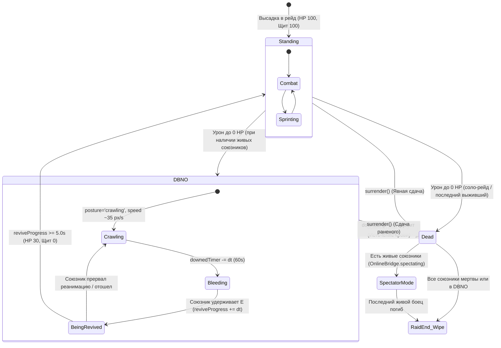

# Архитектурная Спецификация: Система Нокдауна (DBNO) и Полевой Реанимации

**Статус документа**: Актуален для бэкенд-разработчика (DeepSeek)  
**Проект**: BlackWater Protocol (ArcEngine Server)  
**Компоненты**: `server/simulation.mjs`, `server/main.mjs`, `js/OnlineBridge.js`, `js/Game.js`  
**Дата**: Сентябрь 2026  

---

## 1. Концепция и Назначение

В соответствии с боевой моделью *ARC Raiders*, при падении здоровья оперативника до 0 в кооперативном рейде он **не погибает мгновенно**, если в живых остаётся хотя бы один напарник. Вместо этого оперативник переходит в состояние **DBNO (Down But Not Out / Нокдаун)**:
1. **Ползание**: Оперативник падает на землю, может медленно ползти в поисках укрытия.
2. **Истечение крови**: Запускается 60-секундный серверный таймер истечения крови (`downedTimer`).
3. **Полевая реанимация**: Живой напарник может подойти и поднять раненого (удержание `E` в течение 5 секунд), восстановив ему боеспособность.
4. **Добивание (Execution / Thirsting)**: У раненого есть отдельный запас `downedHp = 100`. Враги могут добить раненого прямым огнем до истечения таймера.
5. **Вайп отряда**: Если все оставшиеся в рейде бойцы перешли в состояние DBNO (или погибли), рейд немедленно завершается поражением (`wipe`).
6. **Переход в Режим Наблюдателя**: При завершении таймера истечения крови или обнулении `downedHp` боец окончательно погибает и автоматически переходит в **Режим Наблюдателя** (`spectating = true`), подключаясь к камере выживших союзников (см. `docs/SPECTATOR_SYSTEM_HANDOFF.md`).

---

## 2. Диаграмма Состояний (State Machine)



---

## 3. Авторитетные Серверные Правила (Server-Side Rules)

Все расчеты проводятся **исключительно на авторитетном сервере** (`server/simulation.mjs`):

### 3.1. Структура состояния игрока (`RaidRoom.players`)
Каждый игрок дополнен следующими авторитетными полями:
```javascript
{
    // Базовые параметры
    id: "uuid-string",
    hp: 100,                // 0 в состоянии DBNO и смерти
    maxHp: 100,
    shield: 100,
    maxShield: 100,

    // DBNO & Реанимация
    downed: false,          // true, если боец тяжело ранен
    downedHp: 0,            // Пул прочности раненого (100 при входе в DBNO)
    downedTimer: 0,         // Таймер истечения крови (60.0 секунд)
    reviveProgress: 0,      // Накопленный прогресс подъема (0.0 -> 5.0 с)
    revivingTargetId: null  // ID раненого напарника, которого реанимирует данный боец
}
```

### 3.2. Обработка входящего урона (Ballistics & Hit Resolution)
При попадании снаряда:
1. **Если цель уже в DBNO (`target.downed === true`)**:
   - Урон наносится напрямую в `target.downedHp`.
   - Если `target.downedHp <= 0`:
     - `target.downed = false;`
     - `target.hp = 0;`
     - Регистрация гибели: `this.casualties.add(target.id)`, `this.tally(target.id).deaths++`.
     - Рассылка события `{ type: 'kill', killerId, victimId: target.id, tick }`.
2. **Если цель на ногах (`!target.downed`)**:
   - Стандартный расчет урона по силовому щиту и HP.
   - Если `target.hp <= 0`:
     - Проверяется наличие **других стоящих на ногах союзников**:
       `const standing = [...this.players.values()].filter(p => p.id !== target.id && p.hp > 0 && !p.downed && !p.disconnected);`
     - **Если `standing.length > 0`**:
       - Переход в DBNO:
         - `target.downed = true;`
         - `target.downedHp = 100;`
         - `target.downedTimer = 60.0;`
         - `target.hp = 0;`
         - `target.shield = 0;`
         - `target.posture = 'crawling';`
       - Рассылка события `{ type: 'playerDowned', playerId: target.id, killerId, tick }`.
     - **Если `standing.length === 0`** (соло-рейд или последний боец):
       - Мгновенная гибель (`target.hp = 0`, `target.downed = false`, событие `kill`).

### 3.3. Симуляция тика раненого (`step()`)
1. **Истечение крови**:
   - `p.downedTimer = Math.max(0, p.downedTimer - dt);`
   - При `p.downedTimer <= 0`: боец умирает от кровопотери (`bleedout` -> `kill`).
2. **Ограничение физики и мобильности**:
   - Скорость ползания: множитель `0.32` от базовой скорости шага (~35 px/s).
   - Принудительная высота: `p.height = 24`, `p.eyeHeight = 24`, `p.posture = 'crawling'`.
   - Запрет стрельбы, перезарядки и спринта (игнорируются сервером в `stepFiring` и `input`).

### 3.4. Полевая реанимация (Field Revive Loop)
1. Живой боец посылает в структуре команд `reviveTarget: targetId` (активируется зажатием клавиши `E` / `F`).
2. Сервер проверяет дистанцию между игроками:
   `const dist = Math.hypot(p.x - target.x, p.y - target.y);`
   - Если `dist <= 75 px`:
     - `p.revivingTargetId = target.id;`
     - `target.reviveProgress += dt;`
     - Если `target.reviveProgress >= 5.0` (или 2.5 с с дефибриллятором):
       - Подъем успешен!
       - `target.downed = false;`
       - `target.hp = 30;`
       - `target.shield = 0;`
       - `target.posture = 'crouch';`
       - `target.reviveProgress = 0;`
       - `p.revivingTargetId = null;`
       - Рассылка события `{ type: 'playerRevived', targetId: target.id, reviverId: p.id, tick }`.
   - Если боец отошел (`dist > 75 px`) или отпустил клавишу (`reviveTarget === null`):
     - `p.revivingTargetId = null;`
     - Прогресс реанимации раненого начинает плавно убывать: `target.reviveProgress = Math.max(0, target.reviveProgress - dt * 1.5)`.

### 3.5. Условие командного поражения (Squad Wipe)
В `stepObjectives(dt)`:
```javascript
const standing = [...this.players.values()].filter(p => p.hp > 0 && !p.downed && !p.disconnected);
if (this.players.size > 0 && standing.length === 0) {
    this.endRaid(false, 'wipe');
}
```
Если в отряде не осталось ни одного бойца на ногах (все либо погибли, либо лежат в нокауте), рейд немедленно признаётся проигранным (`wipe`).

---

## 4. Сетевой Протокол и Снапшоты

### 4.1. Формат команды ввода клиента (`command`)
```json
{
  "version": 2,
  "sequence": 1420,
  "forward": 0.0,
  "right": 0.0,
  "heading": -1.57,
  "pitch": 0.0,
  "sprint": false,
  "fire": false,
  "posture": "stand",
  "lean": 0,
  "reviveTarget": "uuid-downed-player"
}
```
- Поле `reviveTarget` передается только тогда, когда игрок зажал клавишу взаимодействия рядом с раненым напарником. В остальных случаях — `null`.

### 4.2. Снапшот игрока (`snapshot.players[]`)
```json
{
  "id": "player-1",
  "x": 380.5,
  "y": 1420.2,
  "h": 12.0,
  "heading": 0.45,
  "pitch": 0.0,
  "hp": 0,
  "shield": 0,
  "maxShield": 100,
  "posture": "crawling",
  "downed": true,
  "downedHp": 85,
  "downedTimer": 48.2,
  "reviveProgress": 1.8,
  "revivingTargetId": null,
  "disconnected": false
}
```

### 4.3. События симуляции (`snapshot.events`)
- `{ type: "playerDowned", playerId: "p1", killerId: "p2", tick: 1240 }` — переход в нокдаун.
- `{ type: "playerRevived", targetId: "p1", reviverId: "p2", tick: 1540 }` — успешное завершение реанимации.
- `{ type: "bleedout", playerId: "p1", tick: 4840 }` — окончательная смерть от потери крови.
- `{ type: "kill", killerId: "p2", victimId: "p1", reason: "bleedout"|"bullet", tick: 4840 }` — фиксация фрага.

---

## 5. Дополнительные Механики для Расширения (Roadmap для DeepSeek)

1. **Био-Дефибриллятор / Нейро-Стиг (Tactical Defibrillator)**:
   - Проверка наличия предмета в быстром слоте реанимирующего игрока.
   - Сокращение времени подъема: с 5.0 до 2.2 секунд.
   - Подъем бойца с 75 HP (вместо 30 HP) и активация немедленного старта регенерации щита.
   - Авторитетное списание 1 единицы предмета из инвентаря на сервере.
2. **Динамический сигнал SOS (Distress Ping)**:
   - Нажатие пробела/СКМ раненым игроком генерирует событие `{ type: "sosPing", playerId, x, y, tick }`.
   - Клиенты союзников отображают пульсирующий аудиовизуальный маяк на компасе и 3D-сцене.
